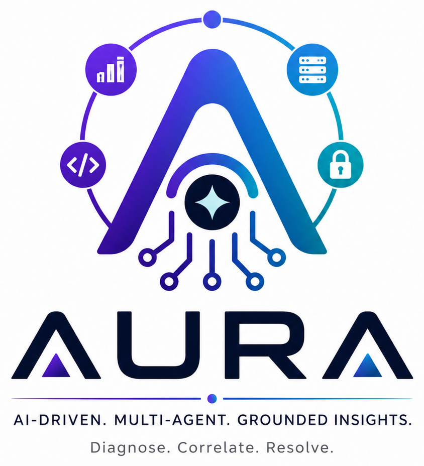

# AURA

  

**Agentic Understanding & Root-cause Analysis**

AURA is an AI-driven, multi-agent diagnostic platform that correlates telemetry, source code, and operational context to produce grounded root cause analysis and remediation guidance—built around a supervisor orchestrator, specialized agents, retrieval memory, and security-first data handling.

## Documentation

| Document | Description |
|----------|-------------|
| [**Architecture (C4 + Mermaid)**](docs/ARCHITECTURE.md) | End-to-end architecture: system context, containers, components, user flows, sequences, and operational scenarios |
| [AI Diagnostic Agent (Word)](docs/AI%20Diagnostic%20Agent.docx) | Source narrative: components, hybrid bridge, security, deployment |
| [AI diagnostics with diagram details (PDF)](docs/AIdiagosticsWithDiagramdetails.pdf) | Consolidated report and diagram references |

Start with [**docs/ARCHITECTURE.md**](docs/ARCHITECTURE.md) for the canonical, diagram-heavy view aligned with the C4 model.
