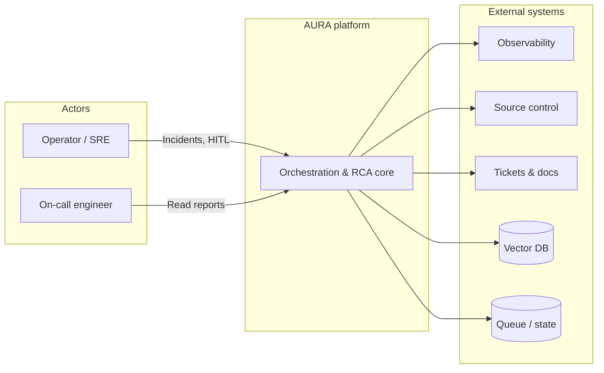
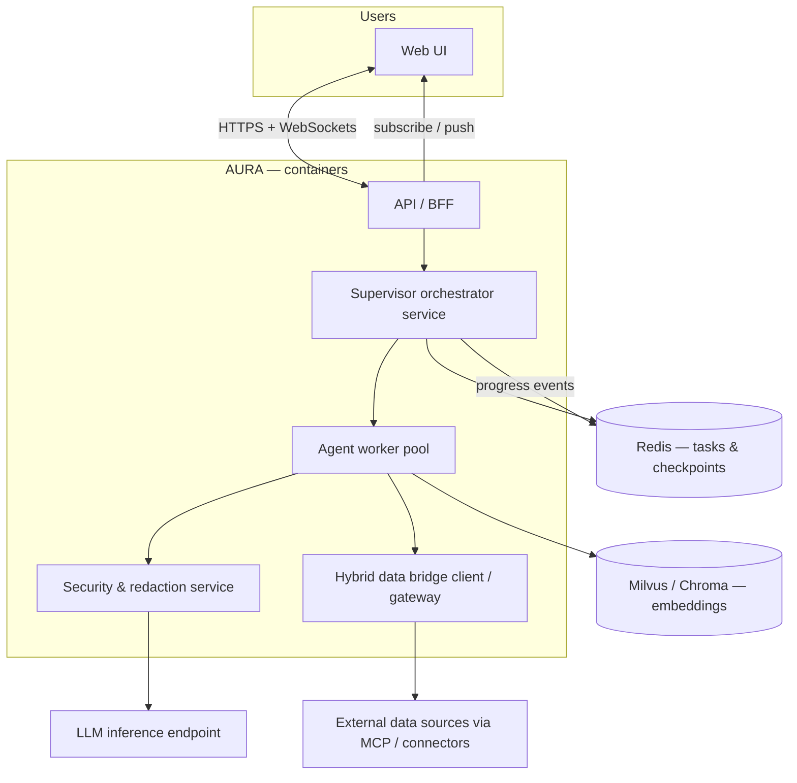
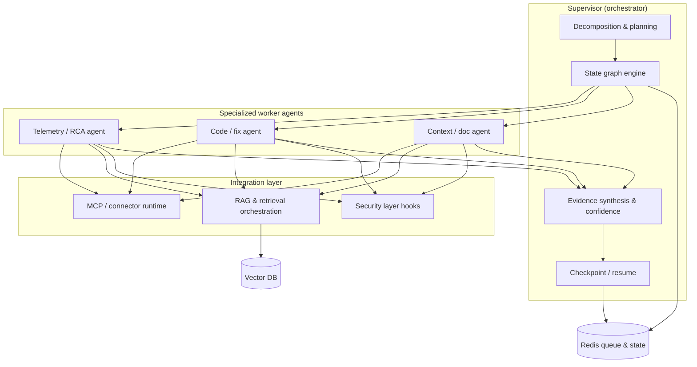
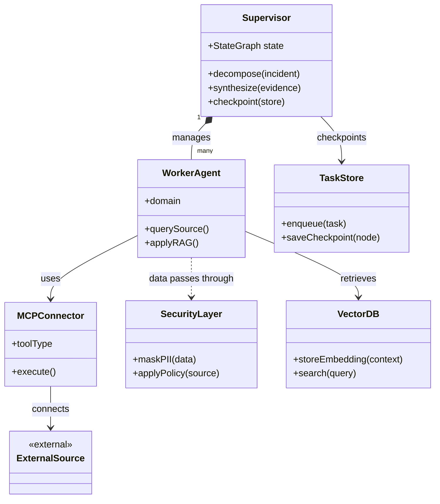
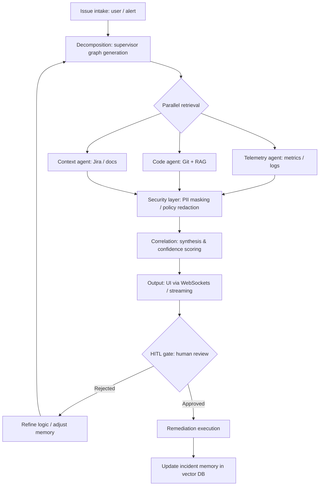
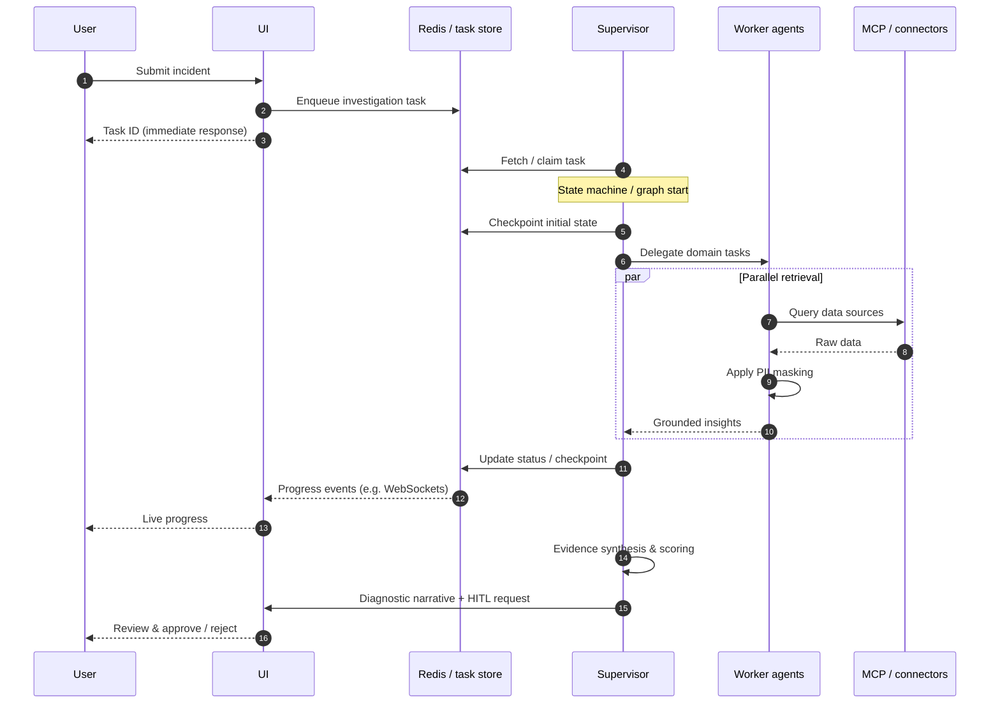
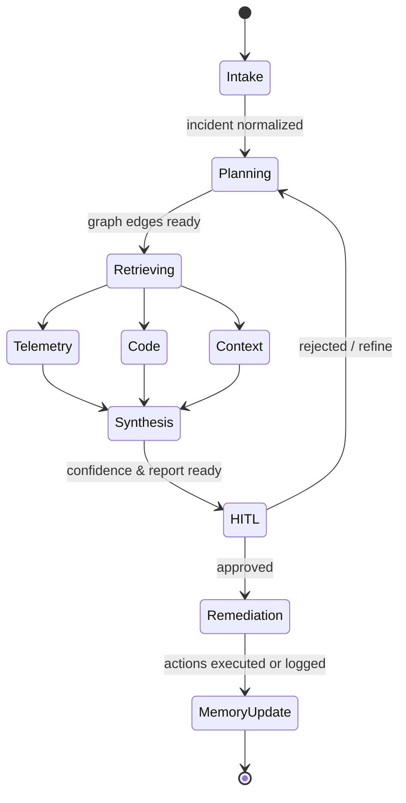
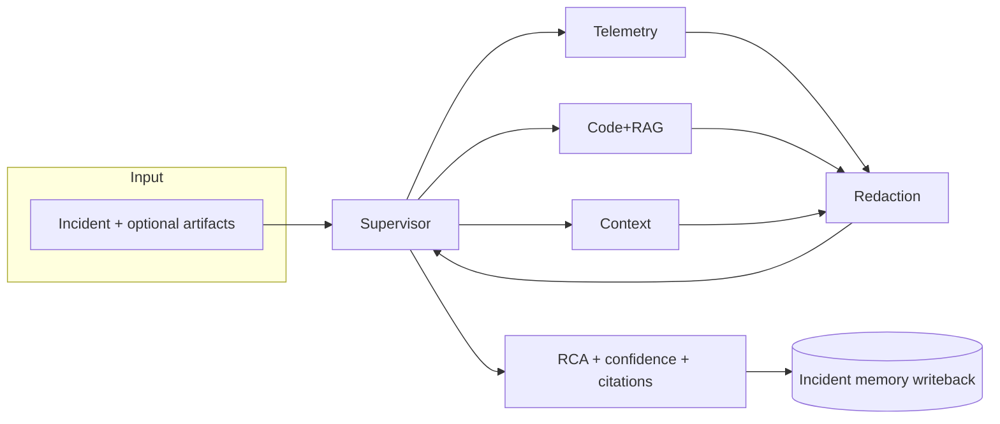
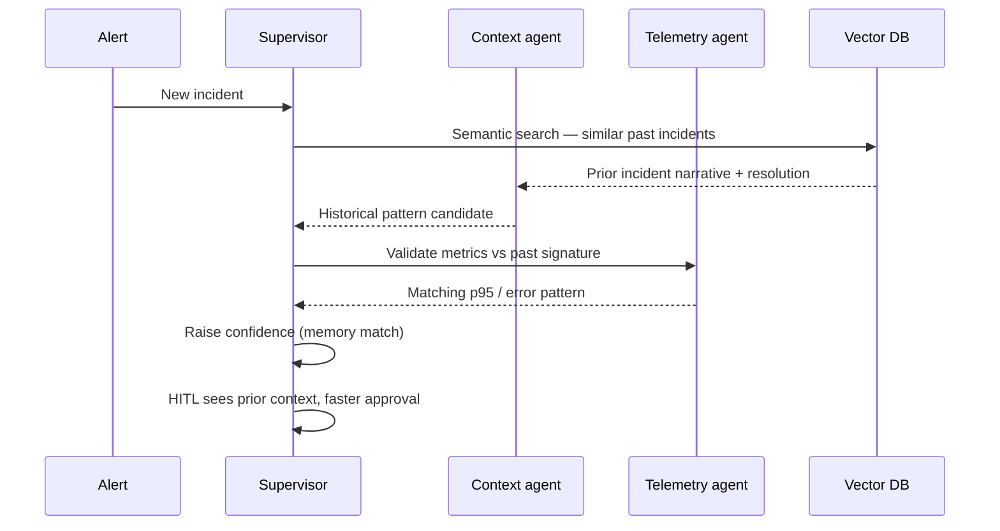
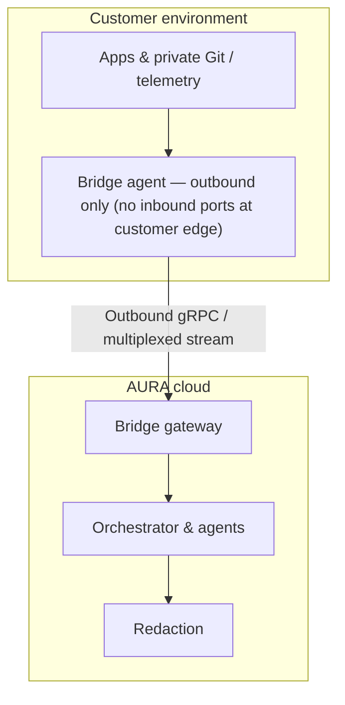

# AURA — Architecture

**AURA** (Agentic Understanding & Root-cause Analysis) is an AI-driven, multi-agent diagnostic and observability system. It correlates telemetry, source code, and operational context under a **security-first**, modular design to produce high-fidelity root cause analysis (RCA) and remediation guidance.

This document follows the [C4 model](https://c4model.com/) — Context, Containers, Components, and optional Code-level detail. Implementation details at **Code** level are intentionally abstract until concrete services and repositories are pinned.

## Abbreviations and acronyms

| Term | Meaning |
|------|---------|
| **AURA** | Agentic Understanding & Root-cause Analysis — this platform. |
| **RCA** | Root cause analysis. |
| **C4** | [C4 model](https://c4model.com/) for layered architecture views. |
| **RAG** | Retrieval-augmented generation — retrieve docs/code/embeddings before answering. |
| **MCP** | Model Context Protocol — standard agent ↔ tool / connector invocation. |
| **HITL** | Human-in-the-loop — operator review gates before remediation or publication. |
| **BFF** | Backend for frontend — API tier tailored to the web UI and sessions. |
| **PII** | Personally identifiable information. |
| **LLM** | Large language model. |
| **ITSM** | IT service management — tickets, change records, knowledge bases. |
| **PromQL** | Prometheus query language (metrics). |
| **KQL** | Kusto query language (e.g. Azure Monitor logs). |
| **gRPC** | RPC framework; often used for multiplexed, efficient streams (hybrid bridge). |
| **SaaS** | Software as a service. |
| **VPC** | Virtual private cloud — customer-controlled network boundary. |
| **AuthN / AuthZ** | Authentication / authorization. |
| **SRE** | Site reliability engineering. |

Where a term appears often in diagrams, labels stay short; this table is the canonical expansion.

---

## Table of contents

[Abbreviations and acronyms](#abbreviations-and-acronyms)

1. [Goals and design principles](#1-goals-and-design-principles)
2. [C4 Level 1 — System context](#2-c4-level-1--system-context)
3. [C4 Level 2 — Containers](#3-c4-level-2--containers)
4. [C4 Level 3 — Components](#4-c4-level-3--components)
5. [End-to-end user and system flows](#5-end-to-end-user-and-system-flows)
6. [Operational scenarios](#6-operational-scenarios)
7. [Security, privacy, and deployment](#7-security-privacy-and-deployment)
8. [Production readiness](#8-production-readiness)
9. [Document map](#9-document-map)

---

## 1. Goals and design principles

| Principle | Implication |
|-----------|-------------|
| **Multi-agent orchestration** | A central supervisor delegates to domain agents; execution is a dynamic graph, not a single linear prompt. |
| **Grounding over guessing** | Retrieval-augmented generation (**RAG**) over code, docs, and **incident memory** reduces hallucinations and ties conclusions to evidence. |
| **Connector abstraction** | External systems (metrics, logs, Git, tickets) sit behind interchangeable connectors (including Model Context Protocol (**MCP**)-style tool protocols). |
| **Security by default** | PII and secret redaction, least-privilege credentials, and boundary-aware deployment before LLM processing. |
| **Resilient async work** | Long investigations are queued and checkpointed; the UI stays responsive with streaming progress. |

---

## 2. C4 Level 1 — System context

**Primary actors:** operators and on-call engineers, automated alerting, and (optionally) service owners approving remediation.

**External systems:** observability backends, source control, work tracking, knowledge bases, and customer-private environments reached via an outbound-safe hybrid bridge.

**How to read this diagram**

- **Actors** submit incidents and approve or reject remediation (**HITL**); engineers consume RCA outputs read-only through the same core.
- **AURA core** is the trust boundary: one logical platform coordinating investigations without exposing internal agent topology at this zoom level.
- **External systems** are everything AURA reads or writes via connectors; **Vector DB** and **Redis** are shown explicitly because embeddings (incident memory, code RAG) and queue/state drive behavior end-to-end.

---

## 3. C4 Level 2 — Containers

Logical deployable units and data stores. Exact boundaries may collapse into fewer physical services in early implementations; the **responsibilities** remain stable.

**Flow (request path vs async path)**

- **Interactive path:** Browser ↔ **API / BFF** ↔ **Orchestrator**; WebSockets carry progress and **HITL** prompts while HTTPS carries queries and commands.
- **Execution path:** Orchestrator schedules **Agent worker pool** tasks; workers call **Security & redaction** before every **LLM** invocation; retrieval hits **Vector DB**; outbound data uses **Hybrid bridge** toward MCP/connectors.
- **Durability:** Orchestrator and workers persist checkpoints and task state to **Redis**; orchestrator also emits progress events consumed by the **API / BFF** for streaming UX.

| Container | Responsibility |
|-----------|------------------|
| **Web UI** | Incident intake, live progress, evidence review, HITL gates, remediation triggers. |
| **API / BFF** | AuthN/Z, session, aggregation of reads/writes, WebSocket fan-out. |
| **Supervisor orchestrator** | Investigation graph (e.g. LangGraph-style), sequencing vs parallelism, synthesis and confidence scoring. |
| **Security & redaction** | PII masking, token scrubbing, policy-driven redaction profiles per source. |
| **Agent worker pool** | Runs telemetry, code/RAG, and context/doc agents; applies masking before model calls. |
| **Hybrid data bridge** | Outbound-initiated secure channel (e.g. multiplexed gRPC) for on-prem / private data without inbound firewall holes. |
| **Redis** | Task queue, async decoupling, orchestration checkpoints, fault tolerance. |
| **Vector DB** | Embeddings for code, docs, playbooks, **incident memory** for recurring-pattern detection. |

---

## 4. C4 Level 3 — Components

Components live mainly inside the **Supervisor orchestrator** and **Agent worker pool**, with shared use of **MCP** (or equivalent) for tool execution.

**Flow**

- **Planning:** **Decomposition & planning** expands an incident into graph edges; **State graph engine** executes branches and merges partial results.
- **Workers:** Telemetry, code, and context agents run in parallel where possible; each uses **MCP** for external APIs and **RAG** for embedding search (**Vector DB**).
- **Safety & persistence:** All worker outputs pass **Security layer hooks** before synthesis; **Evidence synthesis** feeds **Checkpoint / resume**, which writes to **Redis** alongside graph coordination.

### 4.1 Component responsibilities

| Component | Role |
|-----------|------|
| **State graph engine** | Non-linear investigation: branches, joins, replanning based on intermediate agent outputs. |
| **Decomposition & planning** | Turns intake (alert, symptom, stack trace) into a dynamic investigation graph. |
| **Telemetry / RCA agent** | Metrics/logs queries (PromQL, KQL, vendor APIs); spikes, saturation, regional anomalies, error bursts. |
| **Code / fix agent** | RAG over code; correlates regressions with commits/blame; proposes candidate fixes. |
| **Context / doc agent** | Tickets, runbooks, RFCs; distinguishes intentional change vs accidental regression. |
| **MCP / connector runtime** | Standardized execution to observability, Git providers, ITSM, etc., swappable without core logic changes. |
| **Evidence synthesis** | Fuses multi-agent outputs, assigns confidence, prepares narrative for UI and HITL. |
| **Checkpoint / resume** | Persists graph position and partial evidence for retries and partial failures. |

### 4.2 Structural relationships (compact)

Structural view (not a runtime sequence): **Supervisor** owns many **WorkerAgents**; each worker touches **SecurityLayer**, **MCPConnector**, and **VectorDB**; the supervisor persists via **TaskStore**.

---

## 5. End-to-end user and system flows

### 5.1 Investigation lifecycle (logical flow)

From intake through human gate to memory update — aligned with the reference lifecycle in project materials.

**Flow detail**

1. **Normalize intake** — Alert or user-supplied symptoms become a structured incident (severity, scope, time window, optional artifacts).
2. **Plan graph** — Supervisor chooses parallel vs sequential retrieval based on connectors and policies.
3. **Retrieve & mask** — Telemetry, Git/RAG, and **ITSM**/docs queries run concurrently; results pass policy-aware redaction before fusion.
4. **Synthesize** — Evidence is correlated (timelines, deploys, errors); confidence reflects agreement across agents and citation strength.
5. **Human gate** — Rejection loops back to planning or memory tuning; approval triggers remediation hooks (runbooks, tickets, automation).
6. **Memory writeback** — Approved or noteworthy incidents enrich embeddings so recurring failures surface faster later.

- **Parallel retrieval** collapses wall-clock time; **Security layer** runs before synthesis so the **LLM** never sees raw secrets.
- **HITL** is mandatory where policy demands it; rejection explicitly feeds refinement rather than silently retrying the same graph.

### 5.2 Sequence — asynchronous orchestration

Typical timing: user receives a task id immediately; heavy work proceeds asynchronously while the UI subscribes to checkpoint-driven updates.

**Flow detail**

- **Enqueue & acknowledge** — UI writes a durable task; user gets correlation id without waiting for agents.
- **Claim & checkpoint** — Supervisor idempotently claims work, persists graph state to **Redis**, then fans out **MCP** calls through workers.
- **Parallel bounded phase** — `par` block: bounded parallelism with masking applied per connector result set.
- **Progress fan-out** — Status changes land in a store the **API / BFF** can push over WebSockets.
- **Close the loop** — Synthesis produces narrative + **HITL** payload; user decision is captured for audit and feedback.

### 5.3 Supervisor state machine (conceptual)

Conceptual merge: three retrieval branches (**Telemetry**, **Code**, **Context**) enter **Synthesis** independently; production graphs may use guards (timeouts, partial evidence) before synthesis.

**States**

- **Retrieving** — Fan-out to domain agents (logical parallelism); failures map to retries or alternate edges not shown here.
- **Synthesis** — Deterministic-ish fusion step before non-deterministic **LLM** narrative polish (still guarded by citations).
- **HITL** — Blocks remediation until operator signal unless policy allows auto-remediation for low-risk runbooks.
- **MemoryUpdate** — Writes embeddings/summaries for future **RAG** and similarity search.

### 5.4 Component interaction — single “vertical slice”

One incident moving left-to-right: supervisor delegates, agents return evidence through **Redaction**, synthesis yields **RCA** plus pointers into sources, then durable memory captures the outcome.

**Flow detail**

- **Supervisor** remains orchestrator-of-record; agents do not talk peer-to-peer.
- **Redaction** is centralized on the return path so synthesis sees consistent policy application.
- **Incident memory writeback** closes the loop for similarity search on the next incident.

---

## 6. Operational scenarios

### 6.1 Recurring performance regression

Scenario: latency or error spikes resemble a resolved incident already stored in **Vector DB** embeddings.

**Flow detail**

- **Semantic match** narrows candidates (similar symptoms, services, deployments).
- **Context agent** pulls narrative artifacts (ticket text, prior RCA); **Telemetry agent** confirms quantitative overlap (e.g. **p95**, error rates).
- **Supervisor** bumps confidence when signature matches; **HITL** reviewers see cited prior incidents for quicker approval — without skipping accountability.

### 6.2 Hybrid cloud / on-prem ingestion

Scenario: regulated data stays in the customer footprint; only outbound-initiated egress crosses the boundary.

**Flow detail**

- **Bridge agent** runs near apps/Git/telemetry; it opens connections outward — **no inbound listener** required at the customer edge for AURA.
- **Gateway** terminates **gRPC** (or equivalent), authenticates and rate-limits streams, then hands payloads to orchestration.
- **Redaction** remains in cloud policy scope before **LLM** or broad storage; customers may tighten further with VPC/on-prem deployment variants (see §7).

---

## 7. Security, privacy, and deployment

| Topic | Approach |
|-------|----------|
| **PII / secrets** | Automated scrubbing (emails, IPs, tokens); policy profiles per connector and tenant. |
| **Access** | Least privilege, scoped credentials, auditable tool calls. |
| **Residency** | Optional full processing inside customer network; hybrid bridge for controlled egress. |
| **Deployment models** | **SaaS**; **customer VPC**; **on-prem** (including local LLM options). |

---

## 8. Production readiness

- **Horizontal scaling:** Independent pools for telemetry-heavy vs code-heavy workloads.
- **Fault tolerance:** Retries on transient connector failures; **checkpointing** avoids full investigation restarts.
- **Real-time UX:** WebSockets / server push for progress and HITL prompts.
- **Continuous improvement:** Human accept/reject on remediation feeds back into **confidence scoring** and retrieval ranking.

---

## 9. Document map

| Artifact | Purpose |
|----------|---------|
| [README.md](../README.md) | Project entry, link to this architecture |
| [AI Diagnostic Agent.docx](./AI%20Diagnostic%20Agent.docx) | Narrative architecture and workflow (source) |
| [AIdiagosticsWithDiagramdetails.pdf](./AIdiagosticsWithDiagramdetails.pdf) | Consolidated report with diagram snippets (source) |
| **This file** | C4-aligned, Mermaid-first architecture for AURA |

---

*This architecture is derived from the materials under `docs/` and is the living target for AURA implementations. Update this document when container boundaries, stores, or connector standards change.*
