# AURA Frontend — Functional Architecture

This document describes how the AURA web UI is structured, how each layer connects, and how the frontend communicates with the backend services. It is written for developers working on or integrating with the `aura-frontend` codebase.

---

## Table of contents

1. [Tech stack overview](#1-tech-stack-overview)
2. [Repository layout](#2-repository-layout)
3. [Application shell and routing](#3-application-shell-and-routing)
4. [Screen flow and navigation](#4-screen-flow-and-navigation)
5. [Data layer — API client, hooks, and stores](#5-data-layer--api-client-hooks-and-stores)
6. [REST API communication](#6-rest-api-communication)
7. [WebSocket communication](#7-websocket-communication)
8. [Authentication flow](#8-authentication-flow)
9. [State management](#9-state-management)
10. [Component architecture](#10-component-architecture)
11. [Build, deploy, and environment configuration](#11-build-deploy-and-environment-configuration)
12. [Sequence diagrams](#12-sequence-diagrams)

---

## 1. Tech stack overview

| Layer | Technology | Purpose |
|-------|-----------|---------|
| Framework | Expo SDK 52 / React Native 0.76 | Universal app (iOS, Android, Web) |
| Routing | Expo Router v4 (file-based) | URL-driven screens with Stack + Tabs navigators |
| Server state | TanStack React Query v5 | REST caching, polling, retry, mutation lifecycle |
| Client state | Zustand v5 | Lightweight stores for auth and live WS events |
| HTTP | Axios 1.7 | REST calls with interceptors for auth and error shaping |
| Real-time | Native WebSocket | Live investigation progress streaming |
| Token storage | expo-secure-store (native) / AsyncStorage (web) | Platform-adaptive credential persistence |
| Styling | React Native StyleSheet | Inline styles with a shared design-token theme |
| Testing | Jest + React Testing Library + MSW | Unit, component, and integration tests |

---

## 2. Repository layout

```
aura-frontend/
├── app/                          # Expo Router file-based routes
│   ├── _layout.tsx               # Root layout: providers, ErrorBoundary, Stack nav
│   ├── login.tsx                 # Dev/demo sign-in screen
│   ├── +not-found.tsx            # 404 fallback
│   ├── (tabs)/                   # Tab group (bottom tabs on mobile, hidden on web)
│   │   ├── _layout.tsx           # Tabs navigator config
│   │   ├── index.tsx             # Screen 1: Incident Intake form
│   │   └── history.tsx           # Screen 6: Incident History dashboard
│   └── investigations/
│       └── [taskId]/             # Dynamic segment — supervisor task ID
│           ├── progress.tsx      # Screen 2: Live Investigation Progress (WS)
│           ├── evidence.tsx      # Screen 3: Evidence Review
│           ├── approve.tsx       # Screen 4b: HITL Approval + remediation
│           ├── reject.tsx        # Screen 4a: HITL Rejection + replan
│           └── resolved.tsx      # Screen 5: Post-Remediation Summary
│
├── src/
│   ├── api/                      # Thin HTTP wrappers (one file per domain)
│   │   ├── client.ts             # Axios instance + WS base URL + interceptors
│   │   ├── incidents.ts          # submit, get, getByTaskId, listHistory
│   │   ├── investigations.ts    # getEvidenceBundle
│   │   ├── hitl.ts               # submitHITLDecision
│   │   ├── remediation.ts       # triggerRemediation
│   │   └── auth.ts               # fetchDevToken (mock JWT minting)
│   │
│   ├── hooks/                    # React Query + WebSocket hooks
│   │   ├── useInvestigationWS.ts # WebSocket lifecycle, reconnect, replay, auto-nav
│   │   ├── useIncident.ts        # Query/mutation wrappers for incidents
│   │   ├── useEvidenceBundle.ts  # Polls GET evidence until synthesis ready
│   │   ├── useHITLDecision.ts    # Mutation for HITL approval/rejection
│   │   ├── useRemediation.ts     # Mutation for remediation trigger
│   │   └── useIncidentHistory.ts # Paginated incident history query
│   │
│   ├── store/                    # Zustand stores
│   │   ├── authStore.ts          # JWT token, userId, tenantId, hydrate/clear
│   │   ├── investigationStore.ts # Live WS events keyed by taskId
│   │   └── tokenStorage.ts      # SecureStore (native) / AsyncStorage (web)
│   │
│   ├── types/
│   │   └── api.ts                # Full TypeScript types (from OpenAPI spec)
│   │
│   ├── components/
│   │   ├── layout/               # AppShell, Sidebar, NavBar, ScreenContainer
│   │   ├── incidents/            # IncidentForm, IncidentHeader, ArtifactDrawer
│   │   ├── investigation/        # InvestigationGraph, AgentActivityPanel, TimelinePanel
│   │   ├── evidence/             # ConfidencePanel, NarrativePanel, AgentEvidenceTabs, ...
│   │   ├── hitl/                 # ActionChecklist, ReAuthInput, RejectionForm
│   │   ├── history/              # IncidentTable, StatsSummaryBar, FilterBar
│   │   ├── remediation/          # RemediationLog, ErrorRateChart
│   │   ├── branding/             # AuraLogo
│   │   └── ui/                   # Button, Card, MetricCard, SeverityBadge, StatusChip, ...
│   │
│   ├── theme/                    # Design tokens
│   │   ├── colors.ts             # Full color palette (brand, severity, status, ...)
│   │   ├── spacing.ts            # Scale, radius, shadows, layout constants
│   │   └── typography.ts         # Font scale + platform-specific font families
│   │
│   └── utils/                    # Pure helpers
│       ├── formatting.ts         # formatAge, formatDuration, formatPct, truncate
│       └── confidence.ts         # getConfidenceTier, getConfidenceColor, formatConfidence
│
├── tests/                        # Jest test suites (unit, integration, mocks)
├── specs/
│   └── openapi.yaml              # Source-of-truth API contract
├── app.json                      # Expo configuration
├── package.json                  # Dependencies and scripts
└── tsconfig.json                 # TypeScript config (strict, @/* path alias)
```

---

## 3. Application shell and routing

### Provider hierarchy

The root `app/_layout.tsx` wraps every screen in a layered provider stack:

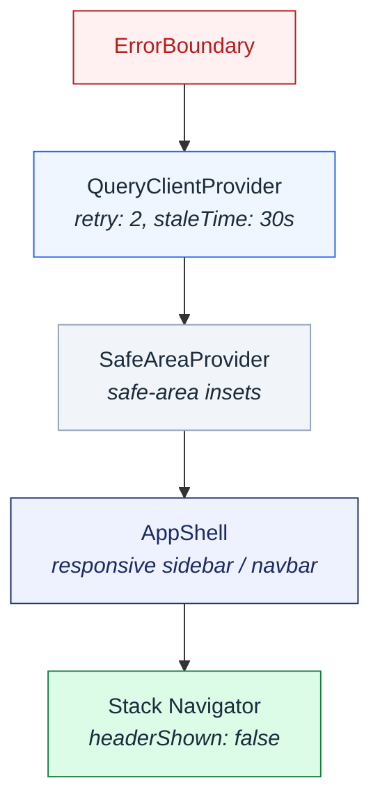

### Responsive layout (`AppShell`)

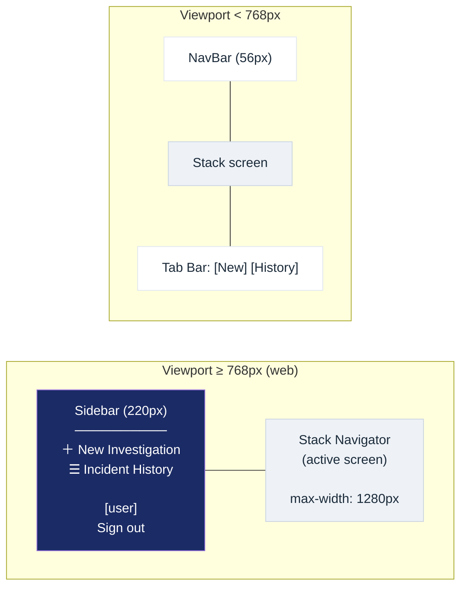

- **Web (≥ 768px):** Navy `Sidebar` on the left, content area fills remaining width (max 1280px). Tab bar hidden.
- **Mobile / narrow:** Compact `NavBar` on top, bottom `Tabs` for New and History. Sidebar hidden.

### Route table

| Route | File | Screen |
|-------|------|--------|
| `/` | `app/(tabs)/index.tsx` | Incident Intake (form) |
| `/history` | `app/(tabs)/history.tsx` | Incident History (dashboard) |
| `/login` | `app/login.tsx` | Dev/demo sign-in |
| `/investigations/[taskId]/progress` | `app/investigations/[taskId]/progress.tsx` | Live Progress (WebSocket) |
| `/investigations/[taskId]/evidence` | `app/investigations/[taskId]/evidence.tsx` | Evidence Review |
| `/investigations/[taskId]/approve` | `app/investigations/[taskId]/approve.tsx` | HITL Approval |
| `/investigations/[taskId]/reject` | `app/investigations/[taskId]/reject.tsx` | HITL Rejection |
| `/investigations/[taskId]/resolved` | `app/investigations/[taskId]/resolved.tsx` | Post-Remediation Summary |

---

## 4. Screen flow and navigation

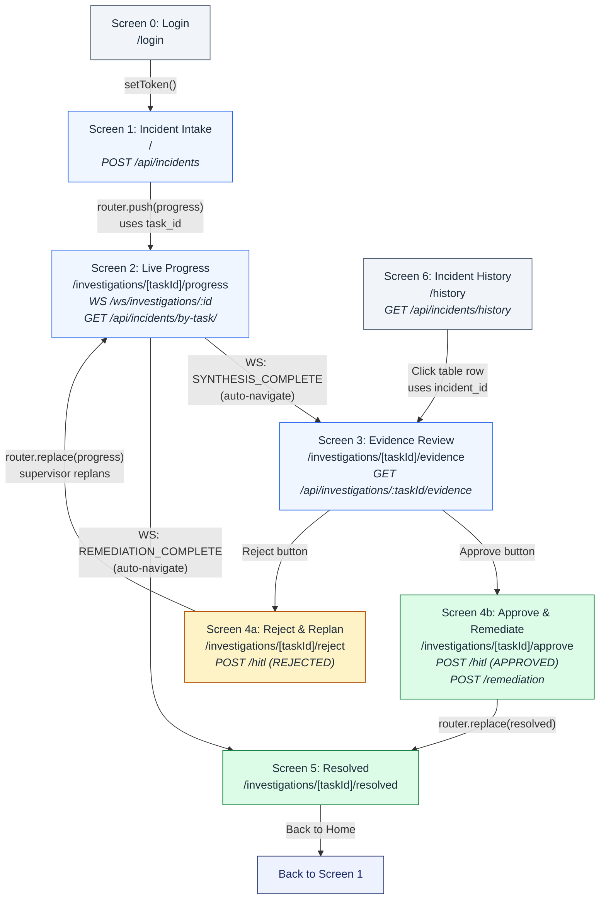

### Navigation rules

- **Intake → Progress:** `router.push()` after successful POST. Uses `task_id` from the response.
- **Progress → Evidence:** Automatic via WebSocket `SYNTHESIS_COMPLETE` event.
- **Progress → Resolved:** Automatic via WebSocket `REMEDIATION_COMPLETE` event.
- **Evidence → Approve/Reject:** Manual button press.
- **Reject → Progress:** `router.replace()` — supervisor replans, user re-watches.
- **Approve → Resolved:** `router.replace()` after HITL + remediation POST succeeds.
- **History → Evidence:** Table row click, using `incident_id` as the route param.

---

## 5. Data layer — API client, hooks, and stores

### Layered architecture

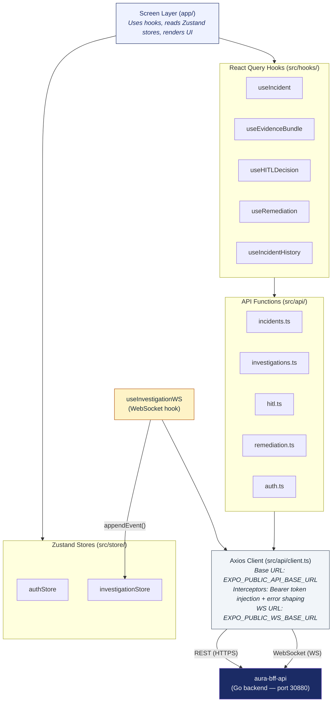

---

## 6. REST API communication

All REST calls go through a single Axios instance in `src/api/client.ts`. The base URL is baked into the static web bundle at build time via `EXPO_PUBLIC_API_BASE_URL`.

### Endpoints used by the frontend

| Method | Endpoint | API function | Used by screen | Purpose |
|--------|----------|-------------|----------------|---------|
| `POST` | `/api/incidents` | `submitIncident()` | Intake | Submit new incident, get back `task_id` |
| `GET` | `/api/incidents/:id` | `getIncident()` | Progress (fallback) | Fetch incident by incident_id |
| `GET` | `/api/incidents/by-task/:taskId` | `getIncidentByTaskId()` | Progress | Fetch incident by task_id |
| `GET` | `/api/incidents/history` | `listIncidentHistory()` | History | Paginated incident list with filters |
| `GET` | `/api/investigations/:taskId/evidence` | `getEvidenceBundle()` | Evidence | Fetch evidence bundle (200=ready, 202=pending) |
| `POST` | `/api/investigations/:taskId/hitl` | `submitHITLDecision()` | Approve/Reject | Submit HITL decision |
| `POST` | `/api/investigations/:taskId/remediation` | `triggerRemediation()` | Approve | Trigger approved remediation actions |
| `POST` | `/auth/dev-token` | `fetchDevToken()` | Login | Mint demo JWT (dev mode only) |

### Request/response flow

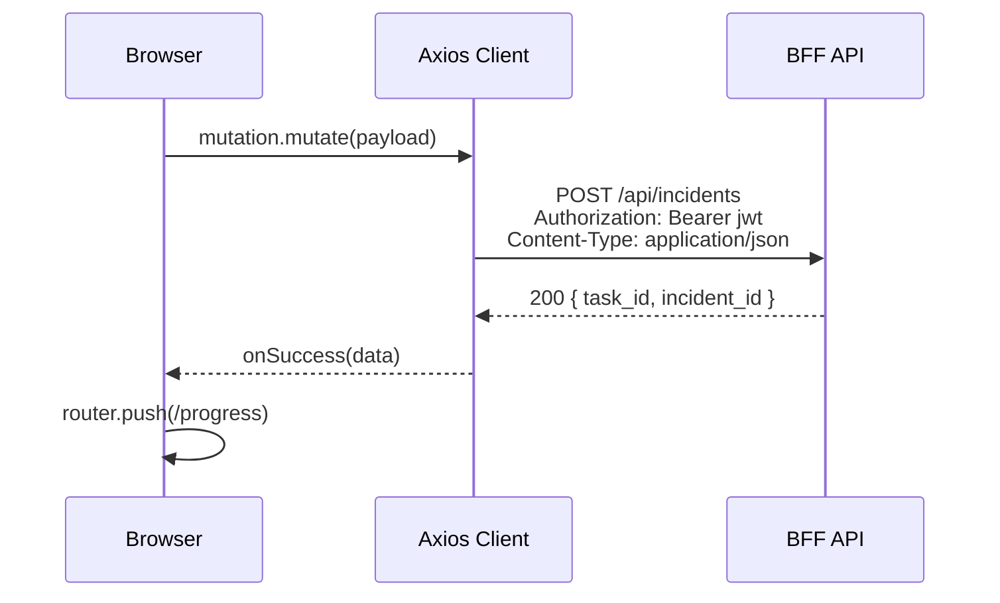

### React Query configuration

- **Retry:** 2 retries on failure (configurable per-query)
- **Stale time:** 30 seconds globally; evidence bundle uses `staleTime: 0`
- **Polling:** Evidence screen polls every 5 seconds while backend returns 202 (synthesis in progress)
- **Cache invalidation:** HITL mutation invalidates evidence bundle cache; incident submission invalidates history

### Error handling

Axios response interceptor normalizes all errors into a typed `ApiError` envelope:

```typescript
interface ApiError {
  error_code: string;   // e.g. "VALIDATION_ERROR", "NETWORK_ERROR"
  message:    string;   // human-readable message
  details?:   Record<string, string>;
}
```

Network errors (timeout, no connection) are shaped into `{ error_code: "NETWORK_ERROR", message: "..." }`.

---

## 7. WebSocket communication

The progress screen opens a persistent WebSocket connection to stream live investigation events.

### Connection lifecycle

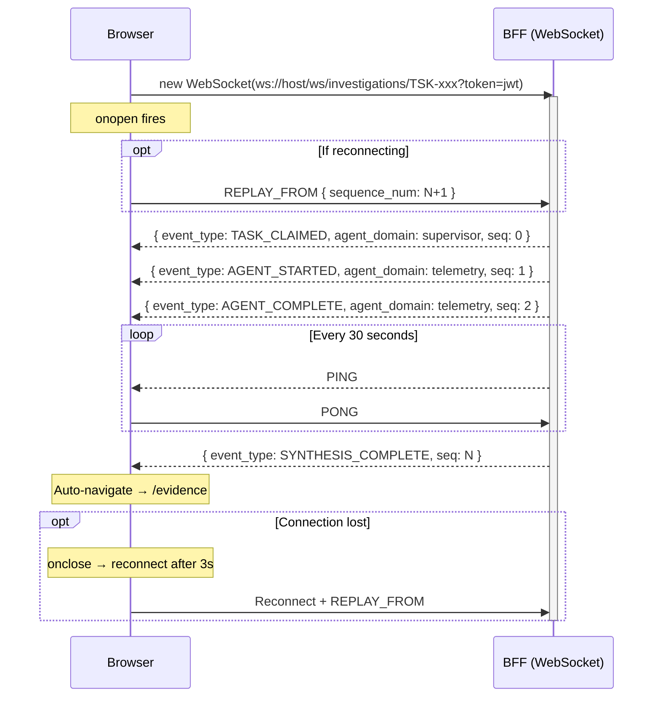

### Key behaviors

| Behavior | Implementation |
|----------|---------------|
| **Auto-reconnect** | `onclose` schedules `connect()` after 3 seconds |
| **Event replay** | On reconnect, sends `REPLAY_FROM { sequence_num }` to recover missed events |
| **Heartbeat** | Client sends `PING` every 30s; if no response in 10s, closes and reconnects |
| **Auto-navigation** | `SYNTHESIS_COMPLETE` → evidence screen; `REMEDIATION_COMPLETE` → resolved screen |
| **Event storage** | All events written to Zustand `investigationStore`, keyed by `taskId` |
| **Cleanup** | WebSocket closed and timers cleared when the progress component unmounts |

### WebSocket event types

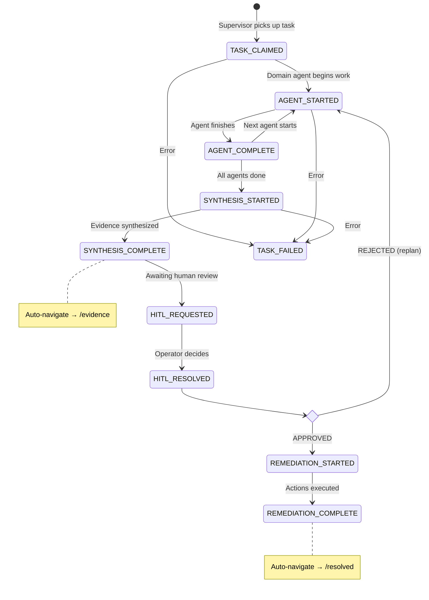

Each event carries `agent_domain` (telemetry | code | context | supervisor) and a monotonic `sequence_num`.

---

## 8. Authentication flow

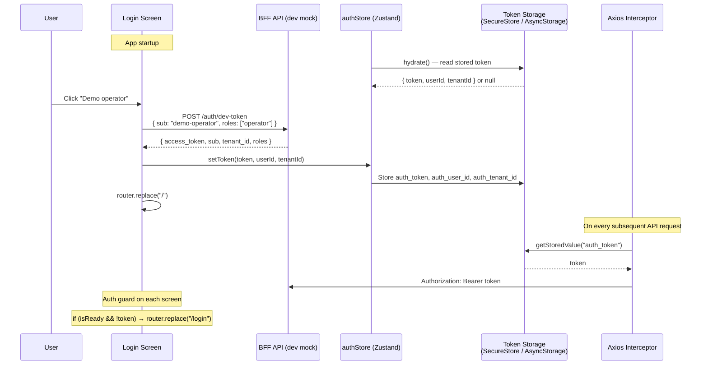

### Token lifecycle

1. **Hydration:** Root layout calls `authStore.hydrate()` on mount. Reads token from platform storage.
2. **Guard:** Each screen checks `isReady && !token`. If not authenticated, redirects to `/login`.
3. **Injection:** Axios request interceptor reads token from storage and adds `Authorization: Bearer <token>`.
4. **WebSocket:** Token passed as query parameter: `ws://host/ws/investigations/:id?token=<jwt>`.
5. **Sign out:** `authStore.clearAuth()` deletes all keys from storage and clears in-memory state.

---

## 9. State management

The app uses two complementary state systems:

### React Query (server state)

Manages all REST API data — caching, background refetching, retry, and mutation lifecycle.

| Query key pattern | Source | Stale time |
|-------------------|--------|------------|
| `['incidents', 'byTask', taskId]` | `getIncidentByTaskId()` | 30s (default) |
| `['incidents', 'byId', incidentId]` | `getIncident()` | 30s (default) |
| `['incidents', 'history', filters]` | `listIncidentHistory()` | 30s |
| `['investigations', taskId, 'evidence']` | `getEvidenceBundle()` | 0 (always fresh, polls every 5s until ready) |

### Zustand (client state)

Two lightweight stores for data that doesn't come from REST:

**`authStore`** — Persisted across sessions via platform storage.

```
{ token, userId, tenantId, isReady }
├── setToken(token, userId, tenantId) → write to storage + update state
├── clearAuth()                       → delete from storage + clear state
└── hydrate()                         → read from storage on startup
```

**`investigationStore`** — In-memory only, populated by the WebSocket hook.

```
{ events: Record<taskId, TaskProgressEvent[]>, lastSequence: Record<taskId, number> }
├── appendEvent(taskId, event)        → push event, update sequence
├── clearTask(taskId)                 → remove all events for a task
├── getEvents(taskId)                 → return events array (or [])
└── latestEventOfType(taskId, type)   → find most recent event of given type
```

---

## 10. Component architecture

### Component hierarchy per screen

```
Screen 1 — Incident Intake
└── ScreenContainer
    ├── Header (title + subtitle)
    ├── Error banner (mutation error)
    └── IncidentForm
        ├── Title input
        ├── Severity chips (P1–P4)
        ├── Scope inputs (service, cluster, region)
        ├── Time window (start, end)
        ├── Symptoms textarea
        ├── Artifacts (type selector + content + add/remove)
        └── Submit Button

Screen 2 — Live Progress
└── ScreenContainer
    ├── Header (title + task ID)
    ├── Error banner (API error + retry)
    ├── IncidentHeader (ID pill, title, severity, status, scope)
    ├── InvestigationGraph (swimlane per agent domain)
    │   └── 4 lanes: Supervisor, Telemetry/RCA, Code/Fix, Context/Docs
    ├── AgentActivityPanel (reverse-chronological event feed)
    └── TimelinePanel (findings from synthesis, if available)

Screen 3 — Evidence Review
└── ScreenContainer
    ├── Header (title + incident ID + iteration)
    ├── ConfidencePanel (overall score + breakdown bars)
    ├── NarrativePanel (synthesis narrative, expand/collapse)
    ├── RootCauseCandidateList (ranked candidates with confidence)
    ├── AgentEvidenceTabs (tabbed per-agent summaries + findings)
    ├── Action buttons (Approve & Remediate / Reject & Replan)
    └── EvidenceDeepLinkDrawer (bottom sheet with evidence metadata)

Screen 4b — Approve
└── ScreenContainer
    ├── Header (title + subtitle)
    ├── ActionChecklist (selectable actions with risk badges)
    └── Card > ReAuthInput (PIN confirmation)

Screen 4a — Reject
└── ScreenContainer
    ├── Header (title + subtitle)
    ├── Error banner
    └── RejectionForm (category chips + free-text reason)

Screen 5 — Resolved
└── ScreenContainer
    ├── Resolved badge + header
    ├── KPI row (MetricCard × 2: diagnosis time, confidence)
    ├── ErrorRateChart (bar sparkline: error rate before/after)
    ├── RemediationLog (timeline entries)
    ├── Similar Past Incidents (Card with match list)
    └── "Back to Home" button

Screen 6 — History
└── ScreenContainer
    ├── Header
    ├── StatsSummaryBar (KPI cards: total, avg time, avg confidence, resolved %)
    ├── FilterBar (search + severity + status chips)
    ├── Error banner
    └── IncidentTable (data table with pagination)
```

### Shared UI primitives (`src/components/ui/`)

| Component | Purpose |
|-----------|---------|
| `Button` | Multi-variant (primary, secondary, danger, ghost) |
| `Card` | White card with shadow, optional tint (success/warning/danger) |
| `MetricCard` | TrueStat-style KPI card with label + value |
| `ConfidenceBar` | Horizontal progress bar with tier label |
| `ProgressBar` | Simple progress bar |
| `SeverityBadge` | Color-coded P1–P4 badge with dot |
| `StatusChip` | Investigation status pill (Queued, Investigating, ...) |
| `Spinner` | ActivityIndicator wrapper (optional fullscreen) |
| `ErrorBoundary` | React class component error boundary with retry |

---

## 11. Build, deploy, and environment configuration

### Environment variables (baked at build time)

| Variable | Default | Purpose |
|----------|---------|---------|
| `EXPO_PUBLIC_API_BASE_URL` | `http://localhost:8080/v1` | BFF REST API base URL |
| `EXPO_PUBLIC_WS_BASE_URL` | `ws://localhost:8080` | BFF WebSocket base URL |

These are set via Terraform (`terraform.tfvars`) and passed as Docker build args.

### Build pipeline

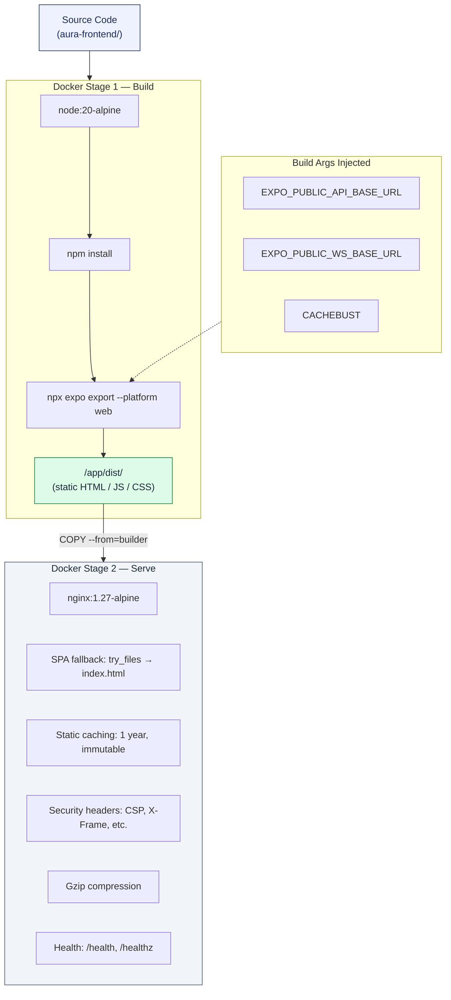

### Local Kubernetes deployment

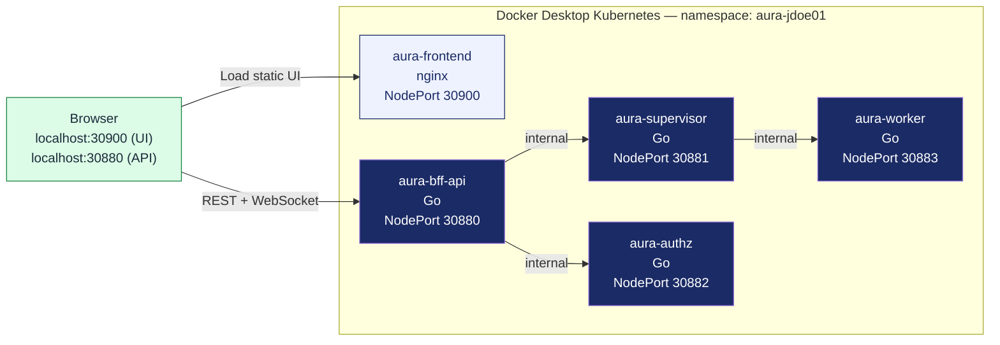

The browser loads the static UI from **port 30900** (nginx). All API calls from the browser go to **port 30880** (BFF). The BFF routes internally to supervisor, authz, and worker services.

---

## 12. Sequence diagrams

### Full investigation lifecycle (happy path)

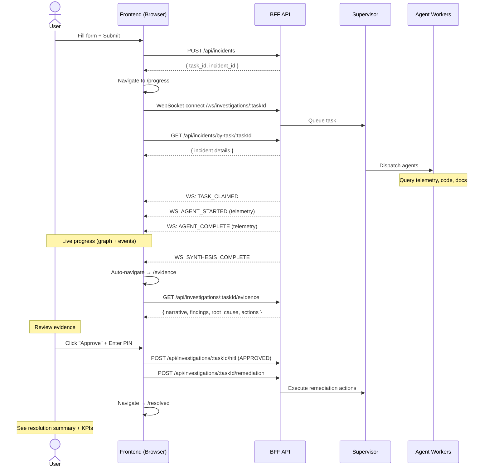

### HITL rejection loop

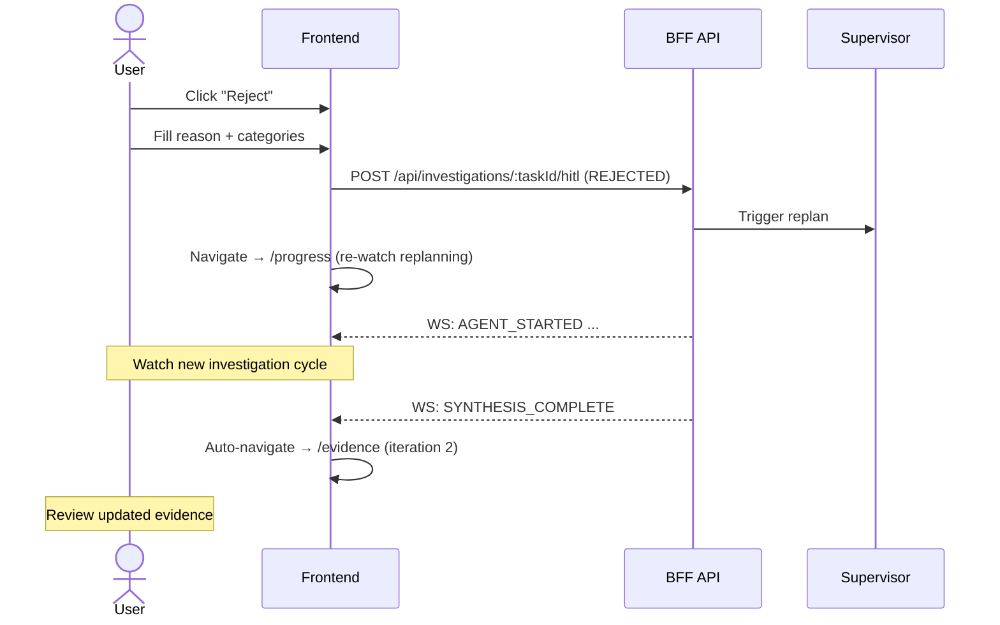

---

## Key design decisions

| Decision | Rationale |
|----------|-----------|
| **Expo Router (file-based routing)** | URL-driven screens work on web and mobile with the same code. Dynamic `[taskId]` segments map naturally to investigation lifecycle. |
| **React Query for REST, Zustand for WS** | React Query handles caching, retry, and cache invalidation for REST endpoints. Zustand is simpler and avoids serialization overhead for rapidly streamed WebSocket events. |
| **Axios interceptors for auth** | Centralizes token injection and error normalization. Every API call automatically gets the Bearer token without per-call boilerplate. |
| **WebSocket with replay** | `REPLAY_FROM` on reconnect ensures no events are lost during network interruptions, keeping the swimlane graph accurate. |
| **Auto-navigation from WS events** | The operator doesn't need to manually check if synthesis is done — the UI automatically advances to the next screen when the backend signals completion. |
| **Platform-adaptive storage** | `expo-secure-store` on native (encrypted keychain), `AsyncStorage` on web. Same API surface, best security per platform. |
| **Static web export + nginx SPA fallback** | Expo exports a static bundle. Nginx's `try_files $uri $uri/ /index.html` ensures deep links to `/investigations/TSK-.../progress` work on page reload. |
| **ErrorBoundary at root** | Catches any unhandled render error across the entire app and shows a retry UI instead of a blank white screen. |
