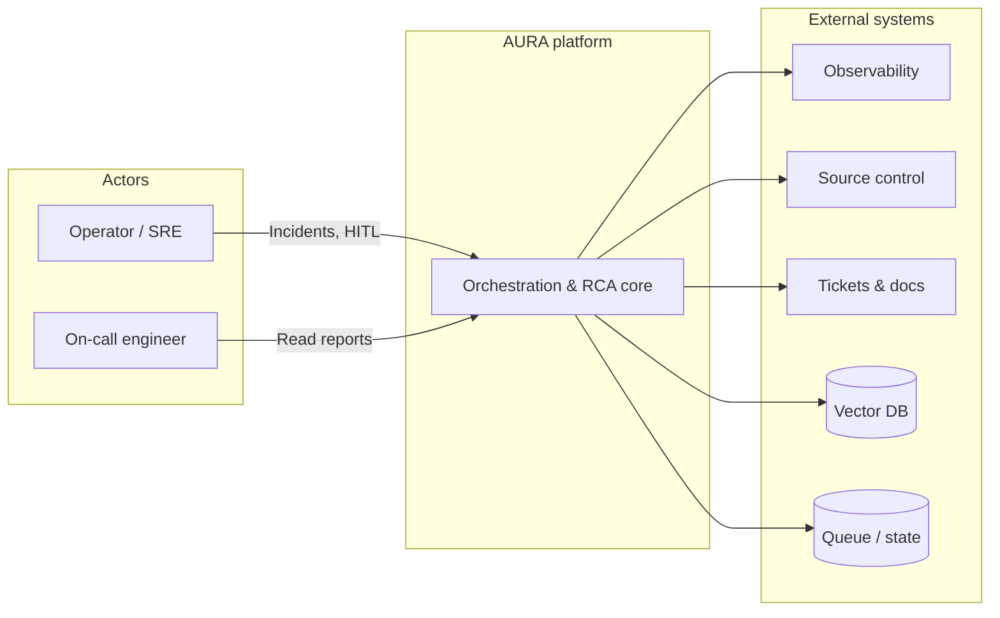
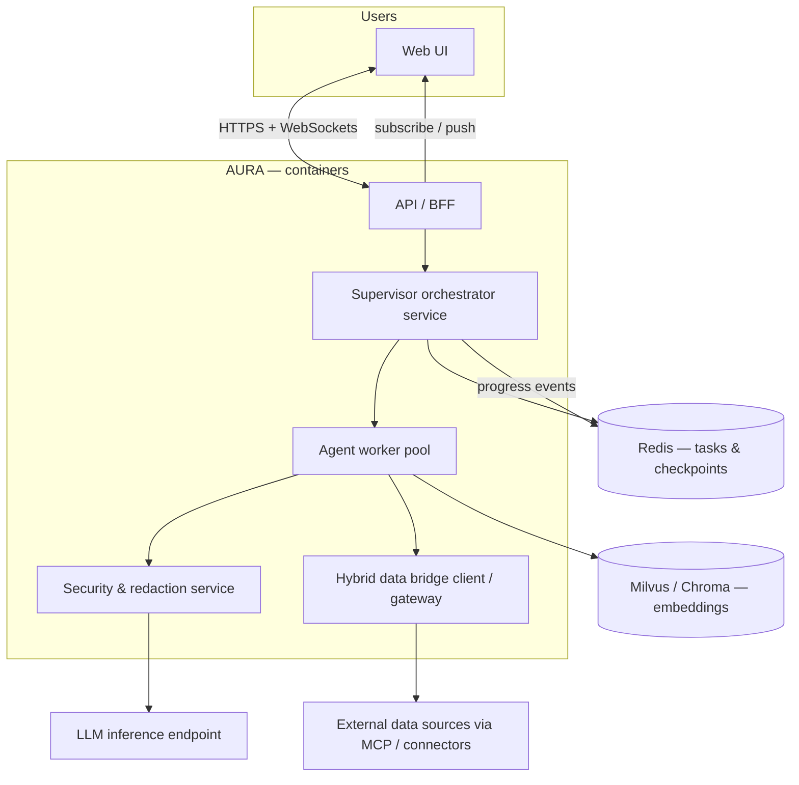
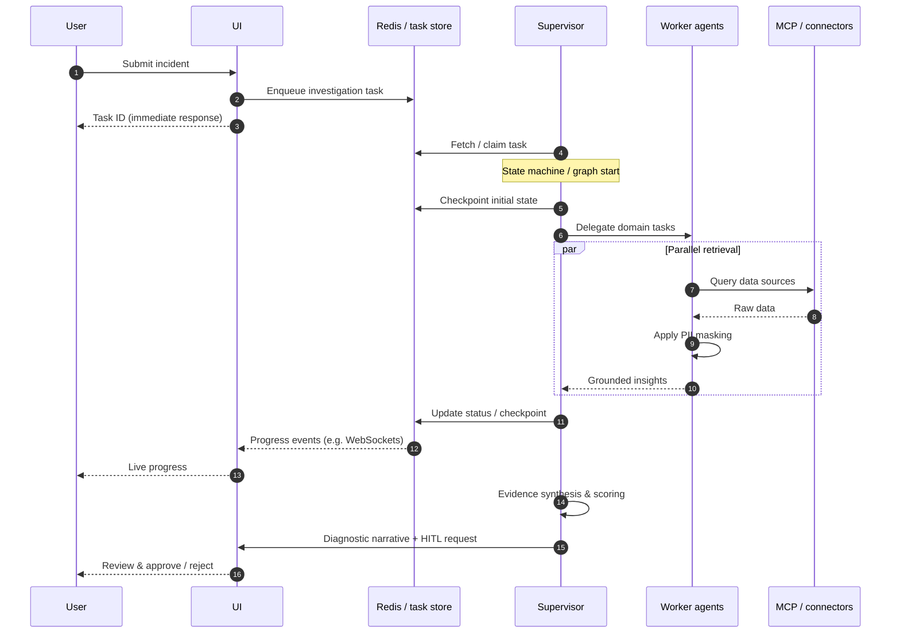
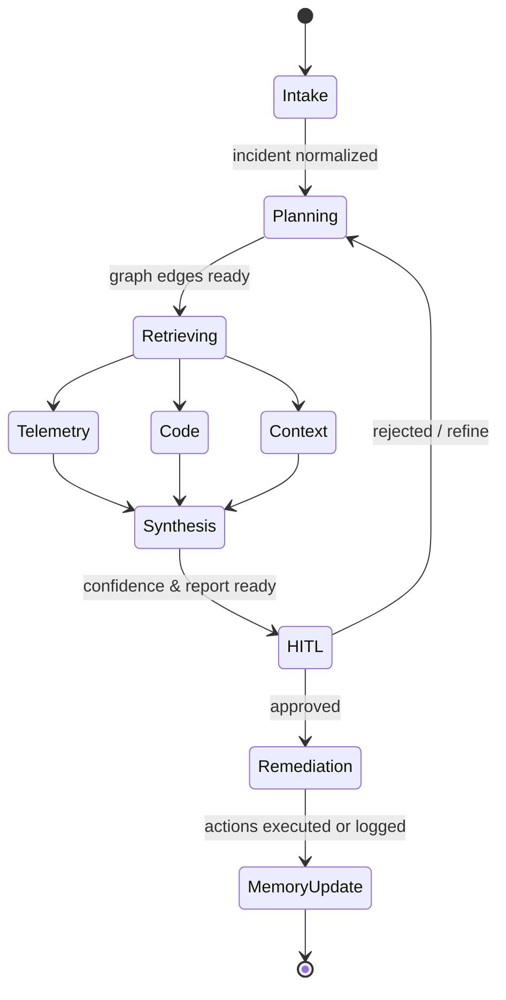
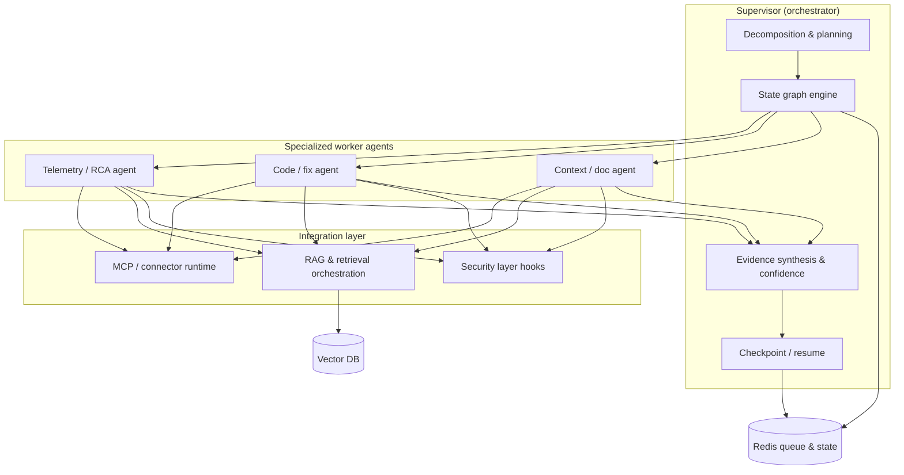
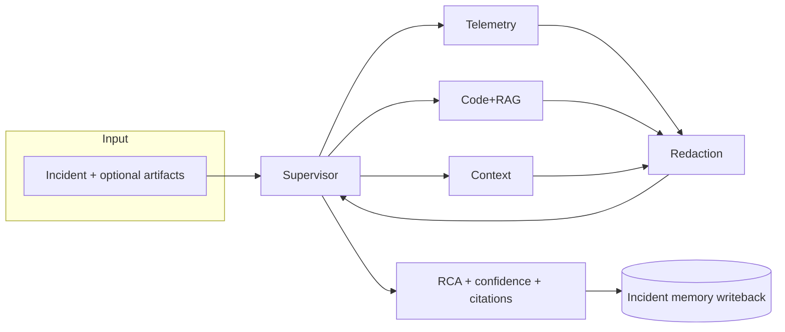
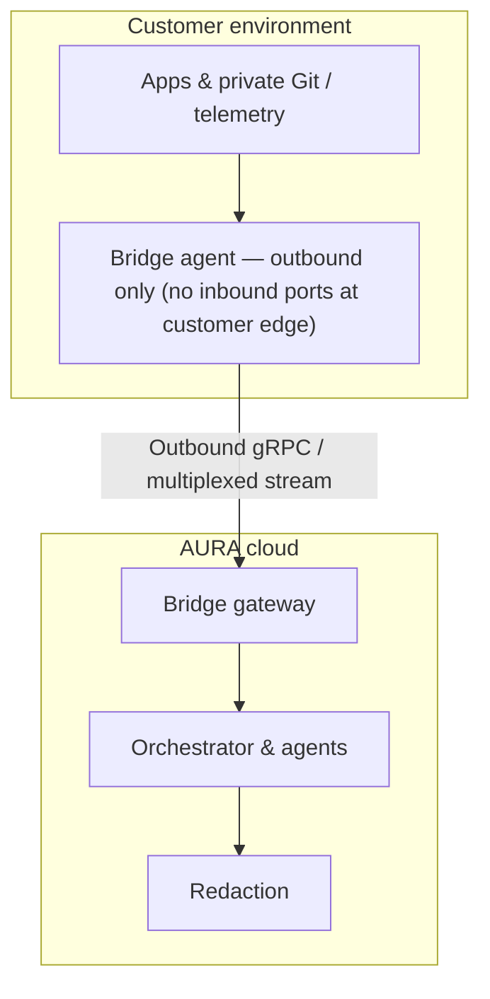
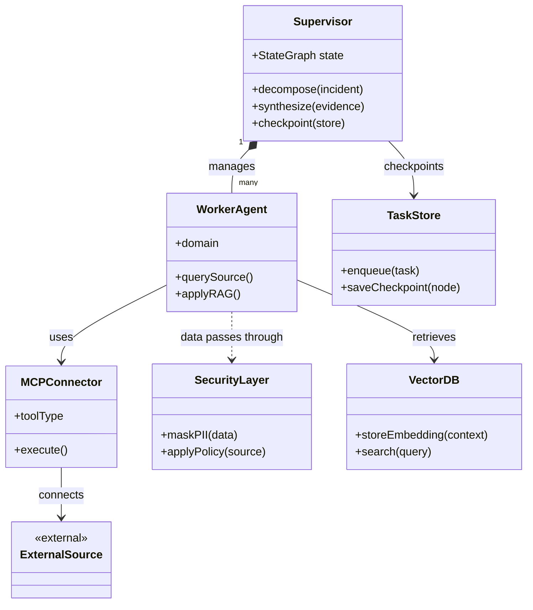
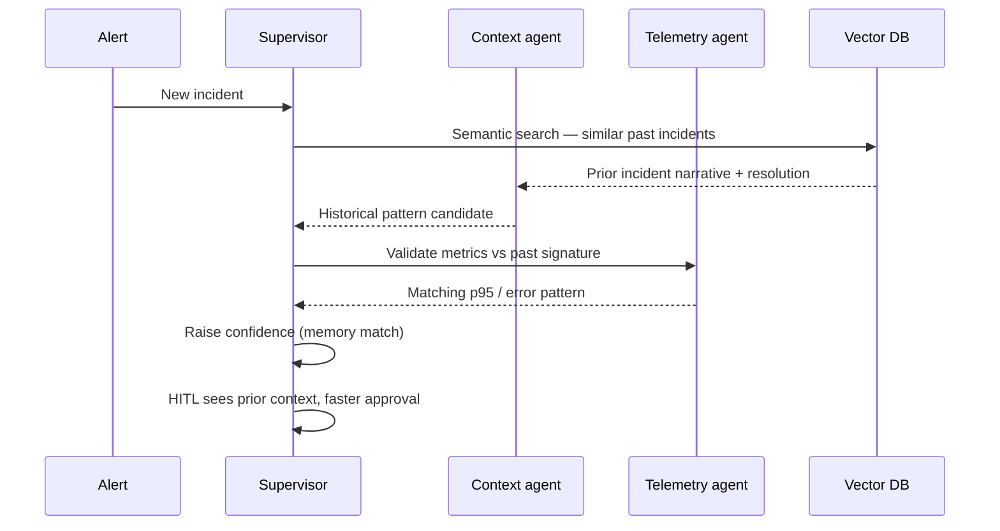

# AURA — Production Specifications

| Field | Value |
|---|---|
| Version | 0.1.0 |
| Status | Draft |
| Date | 2026-05-03 |
| Relationship | Subordinate to `ARCHITECTURE.md`. Architecture is canonical for system boundaries and design principles; this document is canonical for implementation detail, interface contracts, and acceptance criteria. |

---

## Abbreviations and Acronyms

Extends the table in `ARCHITECTURE.md`.

| Term | Meaning |
|---|---|
| AURA | Agentic Understanding & Root-cause Analysis |
| BFF | Backend for frontend |
| gRPC | Google Remote Procedure Call framework |
| HITL | Human-in-the-loop |
| HNSW | Hierarchical navigable small world (ANN index type) |
| ITSM | IT service management |
| JWT | JSON Web Token |
| KQL | Kusto query language |
| LLM | Large language model |
| MCP | Model Context Protocol |
| MTTD | Mean time to detect |
| MTTR | Mean time to recover |
| mTLS | Mutual TLS |
| NFR | Non-functional requirement |
| OIDC | OpenID Connect |
| p50/p95/p99 | 50th/95th/99th percentile latency |
| PII | Personally identifiable information |
| PromQL | Prometheus query language |
| RAG | Retrieval-augmented generation |
| RCA | Root cause analysis |
| SaaS | Software as a service |
| SLO | Service level objective |
| SLA | Service level agreement |
| SRE | Site reliability engineering |
| TTL | Time to live |
| VPC | Virtual private cloud |

---

## Section 1 — Scope and How to Use This Document

### 1.1 What This Document Covers

- Per-service implementation specifications for every AURA container
- Interface contracts and data schemas
- Security controls per service
- Infrastructure sizing and scaling requirements
- SLAs and observability requirements
- Integration test and acceptance criteria

### 1.2 What This Document Does Not Cover

- LLM prompt engineering and system prompt content (separate artifact)
- Vendor selection finalization for Vector DB or embedding model
- Runbook automation script content
- CI/CD pipeline definitions

### 1.3 Container Inventory

| Container | One-liner | Section |
|---|---|---|
| Web UI | Incident intake, live progress, HITL gate, evidence review | §3 |
| API / BFF | AuthN/Z, REST API, WebSocket fan-out | §4 |
| Supervisor Orchestrator | Investigation state graph, agent coordination, synthesis | §5 |
| Security & Redaction Service | PII masking and secrets scrubbing before every LLM call | §6 |
| Agent Worker Pool | Three domain agents: Telemetry, Code/Fix, Context/Doc | §7 |
| Hybrid Data Bridge | Outbound-only gRPC channel for on-prem data | §8 |
| Redis | Task queue, checkpoints, progress event streams | §9 |
| Vector DB | Embeddings for code, docs, incident memory | §10 |
| MCP / Connector Runtime | Standardized execution to all external data sources | §11 |
| LLM Inference Endpoint | External dependency spec and operational requirements | §12 |

### 1.4 System Context



### 1.5 Container Overview



---

## Section 2 — System-Level Non-Functional Requirements

These NFRs cascade into the per-service SLA sections (§3–§12).

### 2.1 Performance

| Metric | Target |
|---|---|
| Intake to task-ID acknowledgment | < 500ms p99 |
| WebSocket progress first event (from task claim) | < 2s |
| Full investigation to HITL prompt delivery | < 120s p95 (median complexity, 3-agent) |
| HITL prompt delivery under load (20 concurrent) | < 180s p95 |
| LLM inference call timeout budget | 30s hard timeout per call; one retry on 429 |

### 2.2 Scalability

- Independent horizontal scaling per worker pool type (telemetry-heavy vs code-heavy).
- Agent workers are stateless — no investigation-scoped state survives beyond a single task claim.
- Redis is the sole shared-state boundary across all replicas.
- Vector DB read path must support concurrent queries from N agent replicas without lock contention.
- API/BFF WebSocket fan-out must support ≥ 500 concurrent investigation sessions per deployment.

### 2.3 Resilience

| Concern | Specification |
|---|---|
| Transient connector failures | Retry with exponential backoff: 3 attempts, base 1s, multiplier 2× (1s → 2s → 4s) |
| Checkpoint granularity | After every completed agent retrieval node |
| Investigation resume | On supervisor restart: re-read checkpoint from Redis, skip completed nodes, re-execute failed/pending nodes only |
| Task claiming | Idempotent via Redis atomic ops (`SET NX PX` or stream consumer-group ACK pattern) |
| Circuit breaker per connector | Open after 5 failures within 30s; half-open probe after 60s; auto-close on 2 consecutive successes |

### 2.4 Security Requirements (System-Level)

- PII and secrets scrubbing is **mandatory** before any data reaches the LLM inference endpoint — no code path bypasses this.
- All inter-service communication in production: TLS 1.2 minimum, TLS 1.3 preferred.
- Hybrid bridge gRPC streams: mTLS with customer-managed client certificates.
- Each connector has its own scoped credential; no shared admin tokens across connectors.
- All tool/connector invocations are auditable: logged with timestamp, connector ID, query hash, redaction flag, response status.
- For on-prem deployment: no raw incident data leaves customer network before redaction.

### 2.5 Observability Requirements (System-Level)

- Every service exposes `/metrics` (Prometheus-compatible), `/health` (liveness), and `/ready` (readiness).
- Structured JSON logs with mandatory fields: `timestamp`, `service`, `level`, `trace_id`, `span_id`, `incident_id`, `task_id`, `tenant_id`, `message`.
- OpenTelemetry-compatible trace propagation (`traceparent`, `tracestate` headers) across all HTTP and gRPC boundaries.
- SLO error budget dashboards per service.

### 2.6 Deployment Model Matrix

| Container | SaaS (cloud) | Customer VPC | On-premises |
|---|---|---|---|
| Web UI | Cloud CDN / hosted | Customer-hosted or cloud | Customer-hosted (nginx container) |
| API / BFF | Cloud | Customer VPC | Customer network |
| Supervisor + Agents | Cloud | Customer VPC | Customer hardware |
| Security & Redaction | Cloud | Customer VPC | Customer hardware |
| Hybrid Data Bridge | Not required (all cloud) | Outbound bridge from VPC | Outbound bridge from on-prem |
| Redis | Cloud managed (ElastiCache / Upstash) | Customer managed or cloud | Customer managed |
| Vector DB | Cloud managed | Customer VPC | Customer hardware + local embed model |
| LLM Endpoint | Anthropic API | Bedrock / Vertex private endpoint | Ollama / vLLM / LM Studio (local) |

---

## Section 3 — Web UI

### 3.1 Responsibilities

- Incident intake form with structured fields.
- Real-time investigation progress via WebSocket subscription.
- Evidence review panel: citations, confidence scores, per-agent findings.
- HITL gate: approve or reject with optional rejection reason.
- Remediation trigger panel (available post-approval).
- Incident history and memory browse.

### 3.2 Incident Intake Schema

```json
{
  "title": "string (max 200 chars)",
  "severity": "P1 | P2 | P3 | P4",
  "scope": "string (service name / cluster / region)",
  "time_window": {
    "start": "ISO-8601",
    "end": "ISO-8601 | null (null = ongoing)"
  },
  "symptoms": "string (max 2000 chars)",
  "artifacts": [
    {
      "artifact_type": "STACK_TRACE | LOG_SNIPPET | ALERT_PAYLOAD | OTHER",
      "content": "string (max 10KB)",
      "source": "string"
    }
  ],
  "tenant_id": "string",
  "submitted_by": "string (user identity)"
}
```

### 3.3 WebSocket Event Schema (`TaskProgressEvent`)

```json
{
  "task_id": "UUID",
  "incident_id": "UUID",
  "event_type": "TASK_CLAIMED | AGENT_STARTED | AGENT_COMPLETE | SYNTHESIS_STARTED | SYNTHESIS_COMPLETE | HITL_REQUESTED | HITL_RESOLVED | REMEDIATION_STARTED | REMEDIATION_COMPLETE | TASK_FAILED",
  "agent_domain": "telemetry | code | context | supervisor | null",
  "payload": "object (event-type specific)",
  "timestamp": "ISO-8601",
  "sequence_num": "integer (monotonic per task)"
}
```

### 3.4 REST Endpoints Consumed by UI

| Method | Path | Purpose |
|---|---|---|
| POST | `/api/incidents` | Submit new incident |
| GET | `/api/incidents/{id}` | Poll incident state |
| GET | `/api/investigations/{task_id}/evidence` | Retrieve full evidence bundle |
| POST | `/api/investigations/{task_id}/hitl` | Submit approve/reject HITL decision |
| POST | `/api/investigations/{task_id}/remediation` | Trigger approved remediation |
| GET | `/api/incidents/history` | Paginated incident memory browse |
| WS | `/ws/investigations/{task_id}` | Live progress subscription |

### 3.5 Security Controls

- AuthN: OIDC/OAuth 2.0 via pluggable identity provider; JWT bearer tokens on all API calls.
- HITL approval actions require re-authentication or elevated session scope to prevent accidental submission.
- No raw incident data in browser localStorage; session-scoped state only.
- HTTPS only; HSTS header on all responses.

### 3.6 Infrastructure Requirements

- Static assets: CDN-distributed, HTTPS only (SaaS); nginx container (VPC/on-prem).
- Browser support: modern evergreen browsers; IE11 explicitly out of scope.
- No server-side rendering required; SPA with API-driven data.

### 3.7 SLAs

| Metric | Target |
|---|---|
| Page load (initial, cached assets) | < 2s p95 |
| WebSocket connection establishment | < 1s |
| HITL panel render (from event delivery) | < 500ms client-side |
| Frontend unhandled error rate | < 0.1% of user actions |

### 3.8 Acceptance Criteria

- Incident submission returns task_id within 500ms.
- Live progress events arrive within 2s of server-side state transitions.
- HITL panel renders with evidence citation links and confidence score.
- Approve action requires an explicit confirmation step before submission.
- WebSocket reconnects transparently and replays missed events using `sequence_num`-based reconciliation.

---

## Section 4 — API / BFF

### 4.1 Responsibilities

- Authentication and authorization enforcement on every inbound request.
- Session lifecycle management.
- REST API aggregation for UI reads and writes.
- WebSocket connection management and fan-out: subscribes to Redis progress event streams, pushes to connected clients.
- Rate limiting and throttling.
- Request validation and input sanitization.
- Audit log emission for all state-mutating operations.

### 4.2 REST API Specification

**`POST /api/incidents`**
- Request body: `IncidentSubmission` (§3.2)
- Response 202: `{ "task_id": "UUID", "incident_id": "UUID", "status": "QUEUED" }`
- Auth scope: `write:incidents`
- Side effect: enqueues investigation task to Redis

**`GET /api/incidents/{id}`**
- Response 200: `{ "incident_id": "UUID", "status": "string", "task_id": "UUID" }`
- Auth scope: `read:incidents`

**`GET /api/investigations/{task_id}/evidence`**
- Response 200: `EvidenceBundle` (§5.6)
- Auth scope: `read:investigations`; tenant isolation enforced

**`POST /api/investigations/{task_id}/hitl`**
- Request body: `{ "decision": "APPROVED | REJECTED", "reason": "string | null", "reviewer_id": "string" }`
- Response 200: `{ "status": "HITL_RESOLVED", "next_state": "REMEDIATION | PLANNING" }`
- Auth scope: `write:hitl`; idempotent (duplicate approval returns 200 with current state)

**`POST /api/investigations/{task_id}/remediation`**
- Request body: `{ "approved_action_ids": ["UUID"] }`
- Response 202: `{ "remediation_task_id": "UUID" }`
- Auth scope: `write:hitl`

**`GET /api/incidents/history`**
- Query params: `page`, `per_page` (max 50), `tenant_id` (JWT-enforced), `severity`, `since`
- Response 200: paginated `IncidentSummary[]`
- Auth scope: `read:incidents`

**`GET /health`** — liveness probe (200 if process healthy)

**`GET /ready`** — readiness probe (200 only if Redis connection is live)

### 4.3 WebSocket Protocol

- Connection: `WS /ws/investigations/{task_id}?token={jwt}`
- Message format: JSON-serialized `TaskProgressEvent` (§3.3)
- Heartbeat: server sends ping every 30s; client must pong within 10s or connection closes.
- Missed event recovery: client sends `{ "type": "REPLAY_FROM", "sequence_num": N }` after reconnect; server replays from Redis Stream.

### 4.4 Authentication and Authorization

- Identity provider: OIDC-compatible; pluggable (Keycloak, Auth0, Okta, Entra ID).
- JWT claims required: `sub`, `tenant_id`, `scope`, `exp`.

| Scope | Grants |
|---|---|
| `read:incidents` | GET incidents and history |
| `write:incidents` | POST new incident |
| `read:investigations` | GET evidence bundle |
| `write:hitl` | POST HITL decision and remediation trigger |
| `admin:config` | Tenant configuration management |

- Multi-tenancy: `tenant_id` JWT claim enforced on every data access. Cross-tenant access is a hard 403 with security audit event emitted.

### 4.5 Rate Limiting

| Limit | Value |
|---|---|
| Incident submissions per tenant per minute | 100 |
| Concurrent active investigations per tenant | 20 (configurable) |
| Concurrent WebSocket connections per user | 10 |
| Exceeded | 429 with `Retry-After` header |

### 4.6 Security Controls

- All request bodies validated against JSON Schema before processing.
- CORS: explicit allowlist of origins; no wildcard in production.
- HTTPS only; HSTS on all responses.
- Audit log: all HITL decisions, incident submissions, and admin operations logged with user identity, timestamp, and action.

### 4.7 Infrastructure Requirements

- Stateless process; horizontal scaling behind load balancer.
- Load balancer must support WebSocket upgrades (sticky sessions not required — WebSocket state is in Redis).
- Min replicas: 2 (HA); scale trigger: CPU > 70% or p95 latency > 200ms.
- BFF is unhealthy if Redis is unreachable (readiness probe fails).

### 4.8 Sequence Diagram — Async Orchestration



### 4.9 SLAs

| Metric | Target |
|---|---|
| REST GET endpoints p99 latency | < 200ms |
| REST POST/write endpoints p99 latency | < 500ms |
| WebSocket availability per tenant | 99.9% |
| WebSocket event fan-out (server publish → all clients) | < 1s |

### 4.10 Acceptance Criteria

- Invalid JWT returns 401 with `WWW-Authenticate` header.
- Cross-tenant data access attempt returns 403 and emits audit event.
- Rate limit exceeded returns 429 with `Retry-After`.
- BFF readiness check fails when Redis is unreachable.
- WebSocket fan-out delivers event to all clients for a task within 1s of Redis publish.

---

## Section 5 — Supervisor Orchestrator

### 5.1 Responsibilities

- Claim investigation tasks from Redis queue (idempotent, competing consumers pattern).
- Normalize intake into `StructuredIncident`.
- Decompose incident into `InvestigationGraph`.
- Execute state graph: fan out to agents, manage joins, handle replanning on HITL rejection.
- Synthesize multi-agent evidence into confidence-scored `EvidenceBundle`.
- Persist checkpoints to Redis after each node completion.
- Emit progress events to Redis Stream for BFF fan-out.
- Trigger memory writeback to Vector DB on investigation close.

### 5.2 State Machine



**Canonical state list:**

```
INTAKE → PLANNING → RETRIEVING →
  TELEMETRY_AGENT | CODE_AGENT | CONTEXT_AGENT →
SYNTHESIS → HITL_PENDING →
  REMEDIATION → MEMORY_WRITEBACK → COMPLETE
PARTIAL_EVIDENCE (some agents failed; supervisor continues with minimum evidence policy)
FAILED (unrecoverable error)
REPLANNING (HITL rejected; re-enters PLANNING with rejection context)
```

**State transition guards:**
- `RETRIEVING → SYNTHESIS`: requires ≥ 1 of 3 agents to have returned evidence (minimum configurable per tenant).
- `SYNTHESIS → HITL_PENDING`: confidence score computed; score ≥ configurable auto-remediation threshold bypasses HITL only if policy explicitly allows it.
- `HITL_PENDING → REPLANNING`: rejection reason appended to incident context; current evidence preserved.

### 5.3 Component Architecture



### 5.4 Vertical Slice — Single Investigation



### 5.5 Interface Contracts

```
Supervisor.decompose(incident: StructuredIncident) → InvestigationGraph
Supervisor.synthesize(evidence: AgentResult[]) → EvidenceBundle
Supervisor.checkpoint(store: TaskStore, state: GraphCheckpoint) → void
Supervisor.replan(graph: InvestigationGraph, rejection: HITLRejection) → InvestigationGraph
```

### 5.6 Data Schemas

**`StructuredIncident`**
```json
{
  "incident_id": "UUID",
  "task_id": "UUID",
  "title": "string",
  "severity": "P1 | P2 | P3 | P4",
  "scope": {
    "service": "string",
    "cluster": "string | null",
    "region": "string | null"
  },
  "time_window": { "start": "ISO-8601", "end": "ISO-8601 | null" },
  "symptoms": "string",
  "artifacts": ["Artifact"],
  "tenant_id": "string",
  "submitted_by": "string",
  "normalized_at": "ISO-8601",
  "metadata": { "key": "string" }
}
```

**`AgentResult`**
```json
{
  "domain": "telemetry | code | context",
  "agent_id": "string",
  "task_id": "UUID",
  "status": "SUCCESS | PARTIAL | FAILED | SKIPPED",
  "findings": ["Finding"],
  "evidence_refs": ["EvidenceRef"],
  "queries_executed": ["QueryLog"],
  "execution_duration_ms": "integer",
  "completed_at": "ISO-8601"
}
```

**`Finding`**
```json
{
  "finding_id": "UUID",
  "type": "string (e.g. METRIC_ANOMALY, COMMIT_REGRESSION, TICKET_CONTEXT)",
  "description": "string",
  "confidence": "float (0.0–1.0)",
  "supporting_evidence": ["EvidenceRef"],
  "timeline_ts": "ISO-8601 | null"
}
```

**`EvidenceBundle`** (output of synthesis; returned to UI and stored for HITL)
```json
{
  "incident_id": "UUID",
  "task_id": "UUID",
  "narrative": "string (LLM-generated, citation-tagged)",
  "confidence_score": "float (0.0–1.0)",
  "confidence_breakdown": {
    "citation_strength": "float",
    "agent_agreement": "float",
    "memory_match_boost": "float",
    "rejection_penalty": "float"
  },
  "per_agent_summaries": [
    { "domain": "string", "summary": "string", "finding_count": "integer" }
  ],
  "root_cause_candidates": [
    { "description": "string", "confidence": "float", "citations": ["EvidenceRef"] }
  ],
  "recommended_actions": ["RecommendedAction"],
  "synthesized_at": "ISO-8601",
  "prior_incident_matches": [
    { "incident_id": "UUID", "similarity_score": "float" }
  ]
}
```

**`GraphCheckpoint`** (Redis-persisted graph state)
```json
{
  "task_id": "UUID",
  "incident_id": "UUID",
  "current_state": "StateEnum",
  "completed_nodes": ["NodeID"],
  "failed_nodes": ["NodeID"],
  "partial_evidence": { "domain": "AgentResult | null" },
  "graph_version": "integer",
  "last_updated": "ISO-8601",
  "ttl_seconds": 86400
}
```

### 5.7 Evidence Synthesis Algorithm

Synthesis is deterministic fusion before non-deterministic LLM narrative generation.

1. **Timeline correlation**: map all evidence timestamps onto a unified timeline; identify windows where anomaly onset, deploy events, and error bursts overlap.
2. **Deploy correlation**: cross-reference Code Agent deploy timestamps with Telemetry anomaly onset.
3. **Confidence scoring**:
   - `citation_strength` = ratio of claims backed by retrieved evidence vs inferred claims
   - `agent_agreement` = overlap fraction between agent-identified root causes
   - `memory_match_boost` = applied when Vector DB semantic search matched a prior incident (scaled by similarity score)
   - `rejection_penalty` = applied on HITL rejection and replan cycle (decays with subsequent replans)
4. **Root cause ranking**: candidates sorted by descending composite confidence.
5. **Narrative**: LLM generates citation-tagged prose from the ranked candidates and agent summaries (post-redaction evidence only).

### 5.8 Security Controls

- Supervisor read/write access to Redis scoped to its key prefix only.
- Supervisor write access to Vector DB scoped to incident memory writeback (not read of all tenants' data).
- Supervisor does not call LLM directly; delegates to agents, which route through Security & Redaction Service first.
- All checkpoint writes include `tenant_id` for namespace isolation.

### 5.9 Infrastructure Requirements

- Single active claim per investigation: enforced via Redis task lock (`lock:task:{task_id}`).
- Multiple supervisor replicas claim tasks independently (competing consumers).
- Min replicas: 2; scale trigger: unclaimed queue depth > 10 for > 30s.
- Max in-memory graph state per investigation: 50MB (enforce via payload limits on connector results).

### 5.10 SLAs

| Metric | Target |
|---|---|
| Task claim latency (queue → supervisor) | < 5s p99 |
| Decomposition time | < 2s p99 |
| Synthesis time (excluding LLM call) | < 5s p99 |
| Full investigation queue to HITL prompt | < 120s p95 |
| Checkpoint write latency | < 100ms p99 |

### 5.11 Acceptance Criteria

- Killing supervisor mid-investigation resumes without re-running completed agent nodes.
- HITL rejection re-enters planning with rejection reason visible in subsequent synthesis narrative.
- With 2 of 3 agents returning `FAILED`, supervisor proceeds with `PARTIAL_EVIDENCE` state (not `FAILED`).
- Memory writeback runs only after HITL approval or explicit policy override.
- State transition audit log captures every state change with timestamp and actor.

---

## Section 6 — Security & Redaction Service

### 6.1 Responsibilities

- Receive raw data payloads from agent workers before LLM submission.
- Detect and mask PII and secrets per built-in rule catalog.
- Apply source-specific and tenant-specific redaction policy overrides.
- Return redacted payload with audit record (rule hits and counts).
- Guarantee: original unmasked data never passes downstream — enforced by service boundary, not caller convention.

### 6.2 Redaction Rule Catalog

| Rule ID | Data Type | Detection Pattern | Replacement Token |
|---|---|---|---|
| PII-001 | Email address | RFC-5321 pattern | `[EMAIL_REDACTED]` |
| PII-002 | IPv4 address | Dotted-decimal with optional port | `[IP_REDACTED]` |
| PII-003 | IPv6 address | Full and compressed forms | `[IP_REDACTED]` |
| PII-004 | Personal name (NLP) | Configurable; off by default | `[NAME_REDACTED]` |
| SEC-001 | API key / bearer token | `sk-`, `Bearer `, `token=`, common vendor prefixes | `[TOKEN_REDACTED]` |
| SEC-002 | AWS credential | `AKIA...`, `aws_secret_access_key` patterns | `[CREDENTIAL_REDACTED]` |
| SEC-003 | Private key | PEM header `-----BEGIN` through footer | `[PRIVATE_KEY_REDACTED]` |
| SEC-004 | Connection string | JDBC, MongoDB, Postgres URI patterns | `[CONNECTION_STRING_REDACTED]` |

### 6.3 Interface Contracts

```
SecurityLayer.maskPII(request: RedactionRequest) → RedactionResponse
SecurityLayer.applyPolicy(source: string, request: RedactionRequest) → RedactionResponse
SecurityLayer.getPolicy(tenant_id: string, source: string) → RedactionPolicy
```

**`RedactionRequest`**
```json
{
  "payload_id": "UUID",
  "source_type": "LOG | CODE | TICKET | METRIC_LABEL | OTHER",
  "source_connector": "string (connector ID)",
  "tenant_id": "string",
  "raw_content": "string (max 1MB per call)",
  "requested_rules": ["RuleID | null (null = apply all applicable)"]
}
```

**`RedactionResponse`**
```json
{
  "payload_id": "UUID",
  "redacted_content": "string",
  "rules_applied": ["RuleID"],
  "match_counts": { "rule_id": "integer" },
  "was_modified": "boolean",
  "processing_time_ms": "integer"
}
```

**`RedactionPolicy`**
```json
{
  "tenant_id": "string",
  "source_type": "string",
  "enabled_rules": ["RuleID"],
  "custom_patterns": [
    { "id": "string", "pattern": "regex", "replacement": "string" }
  ],
  "version": "integer"
}
```

### 6.4 Security Controls (Service-Level)

- Service accepts connections only from Agent Worker Pool (network policy / service-mesh allowlist).
- Raw payload content is never logged; only `payload_id`, `was_modified`, and `match_counts` appear in logs.
- Policy definitions stored in encrypted config store; changes require `admin:config` scope and produce an audit trail entry.
- Service deployed with no outbound internet connectivity (receives, redacts, returns — no external calls).

### 6.5 Infrastructure Requirements

- Stateless; each call is independent.
- Deployable as dedicated service or sidecar (sidecar preferred in on-prem variant for minimal network hop).
- Horizontal scaling tracks agent worker pool size.
- Payload size limit: 1MB per call; callers must chunk larger payloads.

### 6.6 SLAs

| Metric | Target |
|---|---|
| Single-payload redaction latency (≤ 100KB) | < 50ms p99 |
| Single-payload redaction latency (≤ 100KB) p95 | < 30ms |
| False-negative rate (SEC-001–SEC-004) | < 0.01% |
| Availability | Must match agent worker pool (on critical path) |

### 6.7 Acceptance Criteria

- All SEC-001–SEC-004 patterns present in a test payload are masked in output.
- Redacted content is never present in any downstream log, LLM request, or Vector DB write.
- Tenant policy override takes effect within 60s of admin update.
- Service rejects requests from non-agent callers (network policy test).

---

## Section 7 — Agent Worker Pool

### 7.1 Common Worker Agent Specification

#### 7.1.1 Interface Contract

```
WorkerAgent.claim(task: AgentTask) → void
WorkerAgent.querySource(connector_id: string, query: ConnectorQuery) → RawData
WorkerAgent.applyRAG(context: string, filters: RAGFilter) → RetrievedContext
WorkerAgent.submitForRedaction(data: RawData) → RedactedData
WorkerAgent.reportResult(result: AgentResult) → void
```

#### 7.1.2 `AgentTask` Schema

```json
{
  "agent_task_id": "UUID",
  "incident_id": "UUID",
  "task_id": "UUID (parent investigation)",
  "domain": "telemetry | code | context",
  "instructions": "string (supervisor-generated)",
  "time_window": { "start": "ISO-8601", "end": "ISO-8601" },
  "connectors": ["ConnectorConfig"],
  "rag_namespaces": ["string"],
  "priority": "P1 | P2 | P3 | P4",
  "deadline": "ISO-8601"
}
```

#### 7.1.3 Common Security Controls

- Each agent type has its own credential set; telemetry agent cannot access Git credentials, code agent cannot access ITSM credentials.
- Agent processes run as non-root with read-only filesystem (except `/tmp`).
- All LLM calls routed through Security & Redaction Service — never direct.
- Agent result payloads must not contain raw connector credentials.

### 7.2 Telemetry / RCA Agent

#### 7.2.1 Capabilities

- Query Prometheus (PromQL), Azure Monitor / Log Analytics (KQL), Elasticsearch, Grafana Loki.
- Detect: spike (threshold + rate-of-change), saturation, error burst, regional anomaly.
- Correlate anomaly onset timestamp with incident time window.

#### 7.2.2 PromQL Query Templates

| Purpose | Query Pattern |
|---|---|
| Error rate spike | `rate(http_requests_errors_total[5m])` around incident window |
| p95 latency | `histogram_quantile(0.95, rate(http_request_duration_seconds_bucket[5m]))` |
| Memory saturation | `(node_memory_MemTotal_bytes - node_memory_MemAvailable_bytes) / node_memory_MemTotal_bytes` |
| Error rate by service/region | `sum(rate(http_requests_errors_total[5m])) by (service, region)` |

#### 7.2.3 Finding Types

| Type | Fields |
|---|---|
| `METRIC_ANOMALY` | metric name, anomaly onset ts, affected service/region, observed value, baseline, deviation |
| `LOG_ERROR_BURST` | log source, burst start ts, error message pattern, count, rate |
| `SATURATION_EVENT` | resource type, affected node/pod, saturation %, onset ts |
| `REGIONAL_ANOMALY` | affected region, comparison region, metric delta |

#### 7.2.4 RAG Namespaces

- `incident_memory`: similar prior anomaly patterns
- `runbooks`: runbook sections matching detected anomaly type

#### 7.2.5 SLAs

- Query execution timeout: 30s per connector query; agent emits `PARTIAL` result if exceeded.
- p95 agent task completion: < 45s.

### 7.3 Code / Fix Agent

#### 7.3.1 Capabilities

- Query Git provider (GitHub, GitLab, Bitbucket) for commits and PRs in affected services.
- Correlate commit timestamps with telemetry anomaly onset.
- Execute git blame on regression-candidate files.
- RAG over code embeddings for similar patterns and prior fixes.
- Propose candidate fix descriptions (scoped to description; not raw code diff generation by default).

#### 7.3.2 Connector Query Patterns

```
GET /repos/{org}/{repo}/commits?since={start}&until={end}&path={service_path}
GET /repos/{org}/{repo}/pulls?state=closed&merged_at_range={window}
GET /repos/{org}/{repo}/commits/{sha}
GET /repos/{org}/{repo}/blame/{ref}/{path}
```

#### 7.3.3 Finding Types

| Type | Fields |
|---|---|
| `COMMIT_REGRESSION_CANDIDATE` | commit SHA, author (pre-redaction), timestamp, changed files, correlation score |
| `DEPLOY_CORRELATION` | deploy event ts, service, image tag, overlap with anomaly onset |
| `CODE_PATTERN_MATCH` | matched code location, similarity score, RAG source |
| `FIX_PROPOSAL` | description, referenced commit SHA (prior fix), confidence |

#### 7.3.4 RAG Namespaces

- `source_code`: semantic search over indexed codebase embeddings
- `incident_memory`: prior incidents with same service or commit range
- `fix_patterns`: historical fix commits that resolved similar issues

#### 7.3.5 SLAs

- p95 agent task completion: < 60s (code RAG is slower due to embedding search latency).

### 7.4 Context / Doc Agent

#### 7.4.1 Capabilities

- Query Jira/ServiceNow tickets in the incident time window for affected services.
- Retrieve runbooks from Confluence/Notion/ServiceNow KB.
- Retrieve RFC and design documents for affected services.
- Distinguish intentional change (scheduled maintenance, known deployment) vs accidental regression.
- Surface on-call rotation and past similar ticket resolutions.

#### 7.4.2 Connector Query Patterns

```
Jira JQL:       project = {project} AND created >= {start} AND labels in ({service_label}) ORDER BY created DESC
ServiceNow:     GET /api/now/table/incident?sysparm_query=assignment_group={group}^opened_at>={start}
Confluence CQL: GET /wiki/rest/api/content/search?cql=space={space} AND text ~ "{service}"
```

#### 7.4.3 Finding Types

| Type | Fields | Cross-Agent Effect |
|---|---|---|
| `INTENTIONAL_CHANGE` | ticket ID, change type, scheduled window | Suppresses Code Agent's regression confidence |
| `REGRESSION_TICKET` | ticket ID, summary, reporter, created at | Raises agent_agreement in synthesis |
| `RUNBOOK_MATCH` | runbook ID, title, matching section, similarity | Surfaces as recommended action |
| `RFC_CONTEXT` | RFC ID, title, relevant section, decision | Contextualizes design intent |

#### 7.4.4 RAG Namespaces

- `runbooks`
- `incident_memory`
- `docs_rfcs`

#### 7.4.5 SLAs

- p95 agent task completion: < 40s.

### 7.5 Worker Pool Infrastructure Requirements

| Pool | Kubernetes Deployment | Min/Max Replicas | CPU/replica | Memory/replica | Scale Trigger |
|---|---|---|---|---|---|
| Telemetry agents | `deployment/telemetry-agent` | 2 / 10 | 1 core | 2GB | Queue depth > 5 |
| Code agents | `deployment/code-agent` | 2 / 10 | 2 cores | 4GB | Queue depth > 5 |
| Context agents | `deployment/context-agent` | 2 / 8 | 1 core | 2GB | Queue depth > 5 |

Separate deployments per agent type enables independent scaling. All worker processes are stateless.

---

## Section 8 — Hybrid Data Bridge

### 8.1 Responsibilities

- Provide a secure outbound-initiated channel for customer on-prem/private-cloud data.
- Zero-open-port architecture at customer edge: all connections initiated by Bridge Agent outbound.
- Multiplex multiple data source streams over a single gRPC connection.
- Authenticate Bridge Agent to AURA gateway (mTLS + API key in metadata).
- Rate-limit and quota-manage inbound data streams per tenant.

### 8.2 Architecture

Two sub-components:

| Sub-component | Location | Role |
|---|---|---|
| Bridge Agent | Customer environment (on-prem or VPC) | Opens outbound gRPC stream; proxies MCP queries from AURA to local connectors |
| Bridge Gateway | AURA cloud | gRPC server; terminates bridge streams; validates mTLS; routes proxied calls to agent workers |



### 8.3 gRPC Interface Contract

Proto service definition (see `proto/bridge/v1/bridge.proto`):

```protobuf
service HybridBridge {
  rpc OpenBridgeStream(stream BridgeMessage) returns (stream BridgeMessage);
}

message BridgeMessage {
  string stream_id = 1;
  string tenant_id = 2;
  oneof payload {
    MCPQueryRequest  query_request    = 3;
    MCPQueryResponse query_response   = 4;
    Heartbeat        heartbeat        = 5;
    RegistrationRequest  registration = 6;
    RegistrationResponse registration_ack = 7;
  }
}

message MCPQueryRequest {
  string request_id  = 1;
  string connector_id = 2;
  bytes  query_payload = 3;  // JSON-encoded ConnectorQuery
}
```

### 8.4 Security Controls

- mTLS: Bridge Agent presents a client certificate issued by AURA CA; gateway validates against tenant certificate registry.
- API key in gRPC metadata for tenant identification (defense-in-depth with mTLS).
- TLS 1.3 enforced at gRPC layer.
- Bridge Agent cannot receive inbound connections.
- Gateway enforces per-tenant rate limits and payload size limit (max 10MB per MCP response).
- All bridge traffic logged at gateway: tenant, stream ID, connector queried, bytes transferred, timestamp.

### 8.5 Bridge Agent Deployment

- Distributed as standalone binary or container image.
- Supported platforms: Linux x86_64, Linux ARM64, Windows Server 2019+.
- Connectivity requirement: outbound TCP 443 to gateway endpoint only.
- No privileged OS access required; runs as unprivileged service account.
- Configuration: gateway endpoint URL, client certificate path, tenant ID, connector config file.

### 8.6 Bridge Gateway Infrastructure Requirements

- L4 load balancer (TCP passthrough — gRPC streaming is incompatible with standard L7 HTTP termination).
- Consistent hashing on `tenant_id` routes bridge streams to same gateway replica.
- Target: 500 concurrent bridge agent connections per gateway instance.
- Min replicas: 2; scale trigger: connection count > 400.

### 8.7 SLAs

| Metric | Target |
|---|---|
| Bridge stream reconnect time | < 30s |
| Bridge-added latency overhead vs direct connector | < 100ms p95 |
| Bridge Agent uptime SLO | 99.5% (customer-operated; AURA provides monitoring hooks) |

### 8.8 Acceptance Criteria

- Bridge Agent behind NAT with no inbound firewall rule successfully connects and proxies MCP queries.
- mTLS with invalid/expired certificate is rejected at gateway (connection refused; error logged; no data exposure).
- Gateway survives Bridge Agent disconnect and accepts transparent reconnection.
- Data passing through bridge is byte-for-byte identical to direct connector response (post-redaction).

---

## Section 9 — Redis (Task Queue & State Store)

### 9.1 Responsibilities

- Durable task queue for investigation tasks (supervisor claims).
- Agent sub-task queues (supervisor fans out to domain workers).
- Orchestration checkpoint storage per investigation.
- Progress event streams (BFF subscribes for WebSocket fan-out).
- Distributed task-claiming locks.
- Rate-limiting counters.
- Redaction policy configuration cache.

### 9.2 Key Namespace Design

```
# Task queues (Redis Streams with consumer groups)
stream:tasks:{tenant_id}                        → investigation task stream
stream:agent_tasks:{tenant_id}:{domain}         → agent sub-task queues (telemetry | code | context)
stream:progress:{tenant_id}:{task_id}           → progress event stream (BFF consumes)

# Checkpoints (JSON value)
checkpoint:{tenant_id}:{task_id}                → GraphCheckpoint JSON  (TTL: 24h)

# Task status
task:status:{tenant_id}:{task_id}               → { status, created_at, updated_at, claimed_by }

# Locks (string with PX expiry, heartbeat-renewed by supervisor)
lock:task:{task_id}                             → {supervisor_instance_id}  (TTL: 30s)

# Rate limiting
ratelimit:{tenant_id}:investigations            → sliding window counter

# Configuration cache
config:redaction_policy:{tenant_id}:{source}    → RedactionPolicy JSON  (TTL: 60s)
```

### 9.3 Consumer Group Design

| Stream | Consumer Group | Consumers |
|---|---|---|
| `stream:tasks:{tenant_id}` | `supervisor-consumers` | One named consumer per supervisor replica |
| `stream:agent_tasks:{tenant_id}:{domain}` | `agent-{domain}-consumers` | One named consumer per agent replica of that domain |
| `stream:progress:{tenant_id}:{task_id}` | `bff-consumers` | BFF replicas; fan-out to WebSocket clients |

Pending entry re-delivery timeout: 30s (supervisor heartbeat renewal prevents spurious re-delivery for live tasks).

### 9.4 Persistence Configuration

| Setting | Value | Rationale |
|---|---|---|
| AOF `appendfsync` | `everysec` | Balance durability vs performance |
| AOF rewrite trigger | 100% growth or 64MB min | Keeps AOF size bounded |
| RDB snapshots | Every 60s if ≥ 1000 key changes | Secondary backup |
| Max memory policy | `noeviction` | Investigation state must never be silently evicted; alert on memory pressure |

### 9.5 Security Controls

- Redis AUTH (password or ACL) required in all environments.
- TLS encryption for Redis connections in production (Redis 6+ TLS).
- No direct public access; Redis accessible only within private network/VPC.

ACL user assignments:

| User | Access |
|---|---|
| `supervisor_user` | Read/write: task streams, checkpoint, lock namespaces |
| `agent_user` | Read: agent task streams. Write: progress streams |
| `bff_user` | Read: progress streams only |
| `admin_user` | All |

### 9.6 Infrastructure Requirements

- HA: Redis Sentinel (1 primary + 2 replicas); Sentinel failover target < 30s.
- Scale-out: Redis Cluster (when single-node memory > 80% utilized).
- Cloud-managed options: AWS ElastiCache, GCP Memorystore, Azure Cache for Redis.
- On-prem: Redis OSS ≥ 7.0 or Redis Enterprise.
- Initial memory sizing: 4GB (adjust after load testing using formula: `(max_concurrent_investigations × avg_checkpoint_size) + (stream_retention_days × daily_events × avg_event_bytes)`).

### 9.7 SLAs

| Metric | Target |
|---|---|
| Read latency | < 5ms p99 |
| Write latency | < 10ms p99 |
| Sentinel failover | < 30s |

### 9.8 Acceptance Criteria

- Two supervisor replicas racing for the same task: exactly one claims it.
- Progress events delivered to BFF consumer group within 500ms of write.
- On Redis primary failure, Sentinel promotes replica and supervisor reconnects within 30s without checkpoint data loss.
- Checkpoints with expired 24h TTL are automatically removed.

---

## Section 10 — Vector DB (Milvus / Chroma)

### 10.1 Responsibilities

- Store and serve embeddings for source code, runbooks, incident memory, fix patterns, and RFCs.
- Semantic similarity search for RAG queries from agent workers.
- Incident memory writeback after investigation close.
- Tenant-isolated collection management.
- Data retention and right-to-erasure support.

### 10.2 Collection Design

| Collection | Contents | Updated | Isolation |
|---|---|---|---|
| `source_code_{tenant}` | Code file/function embeddings | On new commit (webhook) | Per-tenant |
| `runbooks_{tenant}` | Runbook section embeddings | Scheduled or manual sync | Per-tenant |
| `incident_memory_{tenant}` | Past RCA narratives, symptoms, resolutions | After each closed investigation | Per-tenant |
| `fix_patterns_{tenant}` | Historical fix commit summaries | On PR merge | Per-tenant |
| `docs_rfcs_{tenant}` | Design doc and RFC embeddings | Scheduled sync | Per-tenant |

### 10.3 Interface Contracts

```
VectorDB.storeEmbedding(context: EmbeddingRecord) → { record_id: UUID }
VectorDB.upsert(record: EmbeddingRecord) → { record_id: UUID, was_updated: boolean }
VectorDB.search(query: VectorSearchQuery) → VectorSearchResult[]
VectorDB.deleteByIncident(incident_id: UUID) → void
```

**`EmbeddingRecord`**
```json
{
  "record_id": "UUID | null (null for new insert)",
  "collection": "string",
  "tenant_id": "string",
  "content_text": "string (stored for citation display)",
  "embedding": "float[] (dimension must match embedding model)",
  "metadata": {
    "source_type": "string",
    "source_id": "string",
    "incident_id": "UUID | null",
    "created_at": "ISO-8601"
  }
}
```

**`VectorSearchQuery`**
```json
{
  "collection": "string",
  "tenant_id": "string",
  "query_text": "string (embedded by client before search)",
  "top_k": "integer (default 5, max 20)",
  "filters": { "metadata_key": "value" },
  "min_similarity": "float (default 0.7)"
}
```

### 10.4 Embedding Model Specification

| Deployment Variant | Model | Dimensions |
|---|---|---|
| SaaS / cloud | `text-embedding-3-small` (OpenAI) | 1536 |
| On-premises | `sentence-transformers/all-MiniLM-L6-v2` (self-hosted) | 384 |

Embedding generation is client-side; Vector DB stores raw float vectors. On-prem model deployed via Ollama or HuggingFace Inference Server.

### 10.5 Index Configuration

- Index type: HNSW (approximate nearest neighbor; balance speed vs recall).
- Distance metric: cosine similarity.
- Rebuild required after bulk load before agents can query (blocking gate enforced in indexer).

### 10.6 Security Controls

- Per-tenant collections with access control.
- Agent workers: read-only credential; supervisor writeback: write credential.
- Content text stored alongside vectors is treated under same data residency rules as raw incident data.
- `deleteByIncident` API satisfies GDPR/compliance right-to-erasure flows.

### 10.7 Infrastructure Requirements

- Development: Chroma standalone or Milvus standalone.
- Production: Milvus distributed mode (etcd + MinIO + Milvus cluster); or Zilliz Cloud (managed Milvus).
- Cloud alternatives: Weaviate Cloud, Pinecone.
- Persistence: durable storage mandatory (not in-memory only).

### 10.8 SLAs

| Metric | Target |
|---|---|
| Search latency (top-5, ≤ 1M vectors) | < 100ms p99 |
| Write / upsert latency | < 200ms p99 |
| Writeback queryable delay | < 5s after supervisor writes |

### 10.9 Acceptance Criteria

- Incident memory writeback creates queryable embedding within 5s.
- `min_similarity=0.7` search returns only semantically relevant results (validated with test embedding set).
- Tenant A cannot retrieve Tenant B's embeddings.
- `deleteByIncident` removes all associated embeddings within 60s.

---

## Section 11 — MCP / Connector Runtime

### 11.1 Responsibilities

- Standardized execution interface for all external data source connectors.
- Connector registry: named connectors with type, endpoint, auth config, and health status.
- Execute connector queries on behalf of agent workers.
- Connection pooling and health checking per connector (every 30s).
- Retry and circuit-breaker logic (§2.3).
- Short-TTL result caching (60s) to deduplicate identical queries within the same investigation.

### 11.2 Connector Inventory

| Connector ID | System | Protocol | Auth Method | Query Language |
|---|---|---|---|---|
| `prometheus` | Prometheus | HTTP | Bearer token / basic auth | PromQL |
| `azure_monitor` | Azure Monitor | HTTPS | Azure AD service principal | KQL |
| `elasticsearch` | Elasticsearch | HTTP | API key / basic auth | Elasticsearch DSL |
| `loki` | Grafana Loki | HTTP | Bearer token | LogQL |
| `github` | GitHub | HTTPS | PAT / GitHub App | REST + GraphQL |
| `gitlab` | GitLab | HTTPS | PAT / OAuth | REST |
| `jira` | Jira | HTTPS | OAuth 2.0 / API token | JQL |
| `servicenow` | ServiceNow | HTTPS | OAuth 2.0 | Table API filter |
| `confluence` | Confluence | HTTPS | OAuth 2.0 / API token | CQL |

### 11.3 Interface Contracts

```
MCPConnector.execute(request: ConnectorQuery) → ConnectorResult
MCPConnector.healthCheck() → HealthStatus
```

**`ConnectorQuery`**
```json
{
  "query_id": "UUID",
  "connector_id": "string",
  "query_type": "string (connector-specific: metric_query | log_query | commit_list | etc.)",
  "parameters": { "key": "any (connector-specific)" },
  "time_range": { "start": "ISO-8601", "end": "ISO-8601" },
  "max_results": "integer",
  "timeout_ms": "integer"
}
```

**`ConnectorResult`**
```json
{
  "query_id": "UUID",
  "connector_id": "string",
  "status": "SUCCESS | PARTIAL | ERROR | TIMEOUT",
  "results": "any[] (connector-specific shape)",
  "result_count": "integer",
  "error": { "code": "string", "message": "string" },
  "execution_time_ms": "integer",
  "cached": "boolean"
}
```

### 11.4 Class Diagram



### 11.5 Security Controls

- Credentials stored in secrets manager (HashiCorp Vault, AWS Secrets Manager, or Azure Key Vault).
- Connector credentials never passed in query parameters or logged.
- Connector-specific scoping enforced at registry: telemetry connectors have no access to Git credentials.
- Audit log per execution: connector ID, query hash, status, duration — query content and results are not logged.

### 11.6 SLAs

| Metric | Target |
|---|---|
| Connector health check interval | 30s |
| Cache hit rate within single investigation | > 20% target |
| Stale health status before agent skip | > 2 consecutive failed health checks |

---

## Section 12 — LLM Inference Endpoint

### 12.1 External Dependency Specification

The LLM is treated as an external dependency. This section specifies the interface contract, security constraints, and fallback behavior — not the LLM itself.

### 12.2 Supported Configurations

| Variant | Provider | Notes |
|---|---|---|
| SaaS / default | Anthropic API (Claude Sonnet / Opus) | API key auth; data sent to Anthropic servers |
| Customer VPC | Claude via AWS Bedrock or GCP Vertex AI | Private endpoint; data within customer cloud |
| On-premises | Ollama / vLLM / LM Studio (self-hosted) | No data leaves customer network |

### 12.3 Interface Contract

- Provider: Anthropic Messages API (or compatible).
- Required fields: `system` prompt, `messages` (post-redaction content only), `max_tokens`, `temperature`.
- **Prohibited**: raw connector results before Security & Redaction Service processing.
- Response: text completion and usage metrics (token counts for billing/monitoring).

### 12.4 Security Controls

- LLM endpoint URL and API key stored in secrets manager.
- Zero raw PII/secrets in any LLM request — enforced by Security service gate on the call path.
- LLM response content is not stored verbatim in logs; only synthesized `EvidenceBundle` is persisted.
- For on-prem: LLM endpoint reachable only from agent worker network segment.

### 12.5 Operational Requirements

| Concern | Specification |
|---|---|
| Per-call timeout | 30s hard timeout |
| Retry on 429 (rate limit) | Once, with 5s backoff |
| Retry on 400 (bad request) | No retry — indicates upstream bug |
| Fallback on LLM unavailable | Synthesis produces `EvidenceBundle` with `confidence_score: null`; HITL still presented with raw agent findings and human-readable "synthesis unavailable" message |

### 12.6 SLAs (Dependency)

| Metric | Target |
|---|---|
| Anthropic API availability (SaaS) | 99.9% (per Anthropic SLA) |
| LLM call budget within synthesis flow | ≤ 30s |
| On-prem LLM availability | Customer-managed; AURA provides monitoring hooks |

---

## Section 13 — Cross-Cutting Concerns

### 13.1 Metrics Catalog

All services expose the following standard metrics plus service-specific additions:

```
aura_{service}_request_total{status}                   — request counter
aura_{service}_request_duration_seconds{quantile}      — latency histogram
aura_{service}_errors_total{error_type}                — error counter
aura_investigation_duration_seconds{state}             — investigation phase durations
aura_agent_task_duration_seconds{domain,status}        — per-agent timing
aura_confidence_score_histogram                        — distribution of synthesized confidence scores
aura_hitl_decision_total{decision}                     — approve / reject counts
aura_redaction_matches_total{rule_id}                  — redaction rule hit counts
```

### 13.2 Structured Log Schema

```json
{
  "timestamp": "ISO-8601",
  "service": "string (e.g. supervisor-orchestrator)",
  "level": "INFO | WARN | ERROR",
  "trace_id": "UUID",
  "span_id": "UUID",
  "incident_id": "UUID | null",
  "task_id": "UUID | null",
  "tenant_id": "string",
  "message": "string",
  "fields": {}
}
```

### 13.3 Alerting Thresholds

| Alert | Condition | Severity |
|---|---|---|
| Investigation queue depth | > 20 unclaimed tasks for > 5 min | P2 |
| Supervisor checkpoint failure rate | > 1% of checkpoints failing | P1 |
| Agent task failure rate | > 10% failures per domain per 15 min | P2 |
| Redaction service error rate | > 0.1% error rate | P1 |
| Redis replication lag | > 1s | P2 |
| LLM API error rate | > 5% in 5-min window | P2 |
| Bridge agent disconnection | > 5 min disconnected for active tenant | P2 |
| HITL pending beyond SLA | P1 incident HITL pending > 4h | P1 escalation |

### 13.4 Data Retention Policy

| Data Type | Retention | Notes |
|---|---|---|
| Redis task queue entries | Until ACK + 1h tombstone | Auto-expire |
| Redis checkpoints | 24h TTL | Configurable per tenant |
| Redis progress event streams | 7 days | For replay and audit |
| Vector DB incident memory | 90 days default | Configurable; right-to-erasure via `deleteByIncident` |
| Audit logs (HITL, connector calls) | 1 year | Immutable; exported to cold storage |
| EvidenceBundle (full RCA output) | 90 days | Configurable |
| LLM request/response content | **Not stored** | Never persisted |

### 13.5 Multi-Tenancy Isolation

Every data access path must enforce `tenant_id` isolation:

- Redis: all keys namespaced as `{type}:{tenant_id}:{...}`
- Vector DB: per-tenant collections with access control
- API/BFF: JWT `tenant_id` claim validated on every request
- Supervisor: task claiming scoped to tenant queue
- Security service: redaction policies keyed by `tenant_id`
- Audit: cross-tenant access attempt is a P1 security event

### 13.6 Configuration Management

- Service configuration via environment variables and mounted config files (no hardcoded values).
- Secrets: injected via secrets manager — never in container images or git.
- Feature flags: connector availability, auto-remediation thresholds, confidence score tuning — stored in config store with tenant override capability.
- Hot-reload: redaction policies within 60s; other configuration changes require rolling restart.

---

## Section 14 — Infrastructure Requirements Summary

### 14.1 Service Sizing (Initial Production Targets)

| Service | Min/Max Replicas | CPU/replica | Memory/replica | Scale Trigger |
|---|---|---|---|---|
| Web UI (nginx) | 2 / 5 | 0.25 core | 256MB | RPS > 1000 |
| API / BFF | 2 / 10 | 1 core | 1GB | CPU > 70% or p95 > 200ms |
| Supervisor Orchestrator | 2 / 8 | 2 cores | 4GB | Queue depth > 10 |
| Security & Redaction | 2 / 20 | 1 core | 1GB | CPU > 60% |
| Telemetry Agent Pool | 2 / 10 | 1 core | 2GB | Agent queue depth > 5 |
| Code Agent Pool | 2 / 10 | 2 cores | 4GB | Agent queue depth > 5 |
| Context Agent Pool | 2 / 8 | 1 core | 2GB | Agent queue depth > 5 |
| Hybrid Bridge Gateway | 2 / 6 | 1 core | 2GB | Connection count > 400 |
| Redis (Sentinel) | 3 (fixed) | 2 cores | 8GB | N/A |
| Vector DB (Milvus) | Per Milvus distributed spec | 4 cores | 16GB | Query p95 > 80ms |

### 14.2 Network Architecture

- All inter-service communication on private network/VPC.
- Ingress via load balancer: Web UI and API/BFF only.
- Bridge Gateway: L4 load balancer (TCP passthrough for gRPC streaming).
- No direct public access to: Redis, Vector DB, Security service, Agents, Supervisor.
- Service mesh (Istio/Linkerd) recommended for production mTLS, traffic policy, and observability.

### 14.3 Kubernetes Resource Specifications

Each service Helm chart or Kustomize overlay must include:

- `Deployment` with replica counts and resource requests/limits per §14.1.
- `HorizontalPodAutoscaler` with custom metrics (KEDA for Redis queue depth-based scaling).
- `PodDisruptionBudget`: minimum 1 available for all services.
- `NetworkPolicy`: allowlist only required inter-service communication paths.
- Liveness probe: `GET /health`, `failureThreshold: 3`, `periodSeconds: 10`.
- Readiness probe: `GET /ready`, `failureThreshold: 1`, `periodSeconds: 5`.

---

## Section 15 — Integration Test and Acceptance Criteria

### 15.1 End-to-End Test Scenarios

**Test 1 — Happy-path investigation**
- Input: Synthetic P2 incident with known telemetry anomaly, matching commit, and Jira ticket.
- Expected: All 3 agents complete; synthesis produces `confidence_score` > 0.7; HITL prompt delivered within 120s; approval triggers remediation event.
- Verification: Check Redis event stream, Vector DB writeback, audit log entry.

**Test 2 — Checkpoint resume**
- Input: Submit P1 incident; kill supervisor process after Telemetry agent completes, before Code agent.
- Expected: New supervisor replica picks up from checkpoint, skips Telemetry, completes Code + Context, synthesizes.
- Verification: No duplicate telemetry connector queries; investigation completes within 60s of supervisor restart.

**Test 3 — PII redaction guarantee**
- Input: Incident artifact containing email addresses, IPv4 addresses, and a synthetic API token matching SEC-001 pattern.
- Expected: Security service strips all instances; LLM request payload contains zero regex matches for the PII test patterns.
- Verification: Inspect LLM request payload in test harness before delivery (intercept at security service boundary).

**Test 4 — Hybrid bridge operation**
- Input: Code Agent configured to use bridge-proxied Git connector; Bridge Agent running in isolated network segment.
- Expected: Commit data retrieved successfully through bridge; no direct network path from cloud agent to isolated Git service.
- Verification: Network trace + Bridge Gateway access log shows expected connector queries.

**Test 5 — Recurring incident pattern recognition**



- Pre-condition: Vector DB seeded with prior incident memory for target service.
- Input: New incident with semantically similar symptoms.
- Expected: `prior_incident_matches` in `EvidenceBundle` non-empty with similarity > 0.8; `memory_match_boost` visible in `confidence_breakdown`.
- Verification: Compare `confidence_breakdown` with and without seeded Vector DB.

**Test 6 — Multi-tenant isolation**
- Input: Two tenants simultaneously submitting incidents with overlapping service names.
- Expected: Each investigation sees only its own connector data, Redis keys, and Vector DB results.
- Verification: Cross-tenant query attempt returns 403; no cross-contamination in `EvidenceBundle` citations.

**Test 7 — HITL rejection and replan cycle**
- Input: Submit incident; reject HITL with reason "wrong service identified".
- Expected: Supervisor re-enters PLANNING with rejection reason as additional context; updated synthesis identifies a different root cause candidate.
- Verification: Second `EvidenceBundle` `rejection_penalty` is non-zero; `root_cause_candidates` differ from first synthesis.

### 15.2 Performance Acceptance Tests

| Test | Condition | Pass Criteria |
|---|---|---|
| Load test | 20 concurrent P2 investigations | p95 time-to-HITL-prompt < 180s |
| Redaction throughput | 100 concurrent calls at 100KB each | p99 < 100ms |
| WebSocket fan-out | 200 concurrent clients on same task | All clients receive event within 2s of server publish |

### 15.3 Security Acceptance Tests

| Test | Method | Pass Criteria |
|---|---|---|
| Cross-tenant JWT manipulation | Modify `tenant_id` claim in valid JWT | Returns 403; audit event emitted |
| PII leakage | 100 known PII patterns in synthetic incident | Zero leakage in LLM request payload |
| Bridge mTLS rejection | Present invalid client certificate to gateway | Connection refused; no data exposure |
| Redis ACL enforcement | `bff_user` attempts write to checkpoint namespace | Command rejected by Redis ACL |

---

## Section 16 — Open Questions and Decision Log

| ID | Decision | Options | Owner | Target |
|---|---|---|---|---|
| D-001 | Vector DB selection | Milvus (self-hosted), Zilliz Cloud (managed), Chroma (dev), Weaviate, Pinecone | Platform Eng | TBD |
| D-002 | Embedding model for on-prem | MiniLM-L6 (Ollama), nomic-embed-text, custom fine-tuned | AI/ML | TBD |
| D-003 | Service mesh adoption | Istio (full), Linkerd (lighter), defer to v2 | Infra | TBD |
| D-004 | Auto-remediation threshold | confidence ≥ 0.9 with policy opt-in, never auto, configurable per tenant | Product | TBD |
| D-005 | Confidence score component weighting | Equal weights, telemetry-biased, ML-tuned over time | AI/ML | TBD |
| D-006 | Hybrid bridge distribution format | Standalone binary, Helm chart, Docker image (or all three) | Platform Eng | TBD |

---

## Section 17 — Document History and Approvals

### Version History

| Version | Date | Author | Summary |
|---|---|---|---|
| 0.1.0 | 2026-05-03 | — | Initial draft derived from `ARCHITECTURE.md` and `AIdiagosticsWithDiagramdetails.pdf` |

### Approvals

| Role | Name | Signature | Date |
|---|---|---|---|
| Engineering Lead | | | |
| Security Lead | | | |
| Product Owner | | | |

### Related Documents

| Document | Version | Location |
|---|---|---|
| System Architecture | Latest | `docs/ARCHITECTURE.md` |
| Architecture Narrative | — | `docs/AI Diagnostic Agent.docx` |
| Diagram Reference | — | `docs/AIdiagosticsWithDiagramdetails.pdf` |
| Project Overview | Latest | `README.md` |
