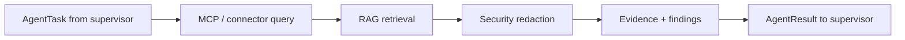
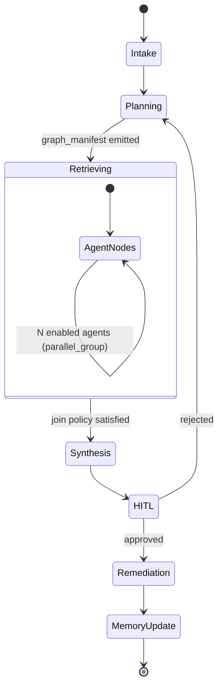

# Supervisor & Configurable Agent Worker Pool — Implementation Plan

**Status:** In progress (Phase 0 + 1 implemented)  
**Last updated:** 2026-05-28  
**Related:** [ARCHITECTURE.md](./ARCHITECTURE.md), [PRODUCTION_SPECIFICATIONS.md](./PRODUCTION_SPECIFICATIONS.md) §5–§7

This document describes a phased plan to implement the **Supervisor orchestrator** with a **configurable agent worker pool**: core RCA agents (telemetry, code, context), optional agents (e.g. Slack / Teams / email), a uniform **MCP → RAG → Security → evidence → synthesis** pipeline, a data-driven **state graph**, stub-first delivery, and thorough unit testing.

---

## Current baseline

| Area | Today |
|------|--------|
| **Supervisor** | Hardcoded mock timeline in `RunMockScenario` (`aura-backend/internal/supervisor/mocktimeline.go`) |
| **Worker** | Three connector mocks: `grafana`, `github`, `jira` (`aura-backend/internal/workersvc/router.go`) |
| **UI** | Four fixed swimlanes in `InvestigationGraph.tsx` (`supervisor`, `telemetry`, `code`, `context`) |
| **Persistence** | In-memory `Store`; no Redis checkpoints yet |
| **Tests** | `go test ./...` in `aura-backend` (orchestration graph, registry, contract, config) |
| **Graph engine** | `internal/orchestration/graph` + `GRAPH_ENGINE_MODE=engine` (default); `legacy` retains `RunMockScenario` |
| **Target** | [ARCHITECTURE.md](./ARCHITECTURE.md) and [PRODUCTION_SPECIFICATIONS.md](./PRODUCTION_SPECIFICATIONS.md) §5–§7 |

---

## Design anchors

### 1. Separate **Agent** from **Connector**

| Concept | Responsibility | Example |
|--------|----------------|---------|
| **Agent** | Domain capability the supervisor schedules | `telemetry`, `code`, `context`, `communications` |
| **Connector** | MCP tool endpoint an agent calls | `grafana`, `prometheus`, `slack`, `teams`, `smtp` |

One agent can use multiple connectors; one connector can be shared (e.g. `jira` by both `context` and `communications`). Customers enable **agents** in config; agents declare which **connectors** they need.

### 2. Uniform agent execution pipeline

Every agent run follows the same stages — implemented once, stubbed early:



**Core interfaces** (Go packages under `aura-backend/internal/orchestration/`):

```go
// Pseudocode — contracts, not final names
type AgentExecutor interface {
    Domain() string
    RequiredConnectors() []string
    Execute(ctx context.Context, task AgentTask) (AgentResult, error)
}

type ConnectorRuntime interface { Invoke(ctx, ConnectorCall) (RawPayload, error) }
type RAGClient         interface { Retrieve(ctx, RAGQuery) (RetrievedContext, error) }
type SecurityClient    interface { Redact(ctx, RawPayload, Policy) (RedactedPayload, error) }
```

**Stub ladder** (swap via config, not code forks):

| Mode | MCP | RAG | Security |
|------|-----|-----|----------|
| `fixture` | YAML `source_mocks` (today) | empty / canned snippets | pass-through + log |
| `http-stub` | worker HTTP routes | mock vector responses | mock security service |
| `live` | real MCP server | Milvus/Chroma | real redaction service |

### 3. Data-driven **InvestigationGraph**

Replace the implicit flow in `mocktimeline.go` with a serializable graph the UI and checkpoint store can read:

```json
{
  "graph_version": 1,
  "nodes": [
    { "id": "intake", "kind": "supervisor", "agent_domain": "supervisor" },
    { "id": "plan", "kind": "plan", "agent_domain": "supervisor" },
    { "id": "tel", "kind": "agent", "agent_domain": "telemetry", "parallel_group": "retrieve" },
    { "id": "comms", "kind": "agent", "agent_domain": "communications", "parallel_group": "retrieve", "optional": true }
  ],
  "edges": [
    { "from": "intake", "to": "plan" },
    { "from": "plan", "to": "tel" },
    { "from": "plan", "to": "comms" },
    { "from": "tel", "to": "synthesis" },
    { "from": "comms", "to": "synthesis", "join": "all_required" }
  ]
}
```

Emit `GRAPH_PLANNED` (or enrich `TASK_CLAIMED`) with `graph_manifest` so the frontend builds swimlanes dynamically instead of the fixed `LANES` array in `InvestigationGraph.tsx`.

### 4. Tenant / deployment configuration

Example `config/agents.yaml` (or env-assembled JSON) loaded at startup:

```yaml
agents:
  telemetry:
    enabled: true
    executor: stub          # stub | live
    connectors: [grafana]
    rag_namespaces: [incident_memory, runbooks]
  code:
    enabled: true
    connectors: [github]
  context:
    enabled: true
    connectors: [jira]
  communications:
    enabled: false          # customer B turns this on
    connectors: [slack, teams, email]
    rag_namespaces: [incident_memory]

policies:
  min_agents_for_synthesis: 1
  synthesis_join: any_success   # all_required | any_success
```

**Env overrides** (ops, no code redeploy): `ENABLED_AGENTS=telemetry,code,context,communications`, `GRAPH_ENGINE_MODE=stub`.

---

## Phased rollout

**Principle:** Default behavior stays identical until a flag is flipped. Deploy order: **worker → supervisor → authz → BFF → frontend** (see `aura-deployment/scripts/README.md`).

### Phase 0 — Test harness and contracts (no user-visible change)

**Goal:** Safe refactoring bedrock; CI gate from day one.

| Deliverable | Location |
|-------------|----------|
| OpenAPI alignment tests | `aura-backend/internal/contract/` — golden WS events vs `aura-frontend/specs/openapi.yaml` |
| Shared domain types | `internal/orchestration/types.go` — `AgentTask`, `AgentResult`, `InvestigationGraph`, `GraphCheckpoint` |
| Interface mocks | `internal/orchestration/mocks/` |
| CI: `go test ./...` | GitHub workflow step |

**Tests:** JSON schema validation for `AgentResult`, `EvidenceBundle`; table tests for config parsing (`ENABLED_AGENTS`, invalid agent names rejected).

**Deploy:** Same images; only adds tests in pipeline.

---

### Phase 1 — Graph engine behind the mock (behavior-preserving)

**Goal:** Extract `RunMockScenario` into a real **state graph runner** that still emits the same WebSocket sequence for the default three agents.

```
internal/supervisor/
  graph/
    model.go      # Node, Edge, InvestigationGraph
    planner.go    # Build default 3-agent graph from config
    runner.go     # Execute nodes, emit WS, update Store status
    checkpoint.go # In-memory CheckpointStore (Redis interface only)
```

- `Planner` reads enabled agents from config; default graph = today's telemetry + code + context in parallel → synthesis → HITL.
- `Runner` replaces sleep+emit loops with node handlers: `SupervisorNode`, `AgentNode` (delegates to existing `SnapshotFetcher` for now).
- `GRAPH_ENGINE_MODE=legacy` keeps calling old `RunMockScenario` for one release, then remove.

**Tests:**

- Graph transition: `INTAKE → PLANNING → RETRIEVING → SYNTHESIS → HITL_PENDING`
- Parallel group: all three agents started before any complete (ordering)
- Join guard: synthesis only after ≥ `min_agents_for_synthesis` complete
- Partial failure: 2/3 failed → `PARTIAL_EVIDENCE` path (per PRODUCTION_SPEC §5.2)
- WS event golden files per fixture `inc2847_api_gateway`

**Deploy:** `GRAPH_ENGINE_MODE=engine` on supervisor only; worker unchanged. UI unchanged (same `agent_domain` values).

---

### Phase 2 — Agent registry and dynamic graph manifest

**Goal:** Configurable agent set; UI can show extra lanes when enabled.

| Component | Change |
|-----------|--------|
| `internal/orchestration/registry` | Register built-in agents: `telemetry`, `code`, `context`, `communications` |
| Planner | Only instantiates nodes for `enabled: true` agents |
| WS | New event `GRAPH_PLANNED` with `graph_manifest: { lanes: [...] }` |
| Frontend | `InvestigationGraph` builds lanes from manifest + fallback to current 4 lanes |
| OpenAPI | Extend `agent_domain` from enum to `string` + documented known values |

**Stub communications agent:** returns fixture findings (e.g. “#incidents channel mentioned outage”) without real Slack.

**Tests:**

- Registry: unknown agent in config → startup error or skip with audit log
- Planner: `communications` disabled → graph has no comms node
- Planner: all optional agents off → synthesis join still works with telemetry only
- Frontend unit test: manifest with 5 lanes renders 5 columns

**Deploy:** Enable `communications` only in dev/staging via `ENABLED_AGENTS`. Production default unchanged.

---

### Phase 3 — Worker agent pool framework (supervisor delegates real tasks)

**Goal:** Move from “supervisor calls worker for snapshots” to “supervisor dispatches **AgentTask**; worker runs pipeline stubs.”

**Worker API (new):**

```
POST /v1/agents/{domain}/execute
Body: AgentTask
Response: AgentResult
```

**Worker structure:**

```
internal/workersvc/
  registry.go
  pipeline/
    executor.go    # orchestrates MCP → RAG → SEC → findings
    stub_mcp.go
    stub_rag.go
    stub_security.go
  agents/
    telemetry.go
    code.go
    context.go
    communications.go
```

Each agent file declares `RequiredConnectors()` and uses shared `pipeline.Executor`. Fixture path: read `source_mocks` from YAML (existing pattern in `router.go`).

**Supervisor:** `AgentNode` calls worker HTTP instead of inline `SnapshotFetcher` (keep fetcher as fallback when `WORKER_URL` unset).

**Tests:**

- Pipeline: verify MCP called before RAG before Security (order enforced)
- Per-agent: telemetry cannot invoke `github` connector (credential isolation)
- Contract test: supervisor POST task → worker response matches `AgentResult` schema
- Timeout: agent returns `PARTIAL` after 30s (mock clock)

**Deploy:** Worker first (new route, old `/v1/sources/{source}` kept). Supervisor uses worker execute when `AGENT_EXECUTION_MODE=worker`.

---

### Phase 4 — Communications agent + connector stubs

**Goal:** Prove extensibility with Slack / Teams / email without breaking the RCA trio.

| Connector mocks | Fixture keys in YAML |
|-----------------|----------------------|
| `slack`, `teams`, `email` | `source_mocks.slack`, etc. |

**Communications agent finding types (examples):**

- `CHANNEL_ALERT_MENTION` — incident discussed in channel
- `ONCALL_PING` — pager mention correlation
- `EMAIL_THREAD` — related outage thread

Synthesis must treat `communications` like any other domain in `agent_agreement` scoring (PRODUCTION_SPEC §5.7).

**Tests:**

- Graph with 4 parallel retrieve nodes
- Synthesis includes comms summary when enabled; omits when disabled
- Cross-agent: comms timestamp overlaps telemetry anomaly → confidence boost

**Deploy:** Staged tenant profile; document env vars in deployment docs.

---

### Phase 5 — MCP connector runtime (incremental go-live)

**Goal:** Replace fixture MCP with pluggable connector drivers behind one interface.

```
internal/connectors/
  runtime.go       # RegisterConnector, Invoke
  grafana_stub.go
  github_stub.go
  slack_stub.go
  ...
```

- **Phase 5a:** MCP in-process stubs (same payloads as YAML)
- **Phase 5b:** One real connector (e.g. Grafana) behind feature flag `CONNECTOR_GRAFANA_MODE=live`
- Circuit breaker per connector (PRODUCTION_SPEC §2.3)

**Tests:** Circuit opens after 5 failures; half-open probe; idempotent retries.

**Deploy:** Per-connector flags; no graph changes.

---

### Phase 6 — Redis checkpoints and resume

**Goal:** Production resilience without changing graph semantics.

- `CheckpointStore` interface: memory (dev) | Redis (prod)
- Persist after each agent node completes (`GraphCheckpoint` from PRODUCTION_SPEC §5.6)
- On supervisor restart: reload checkpoint, skip `completed_nodes`, re-run failed/pending only

**Tests:** Kill runner mid-graph (inject cancel); resume completes synthesis without duplicate `AGENT_COMPLETE` events (or emits `AGENT_SKIPPED` for completed).

**Deploy:** Redis URL on supervisor; `CHECKPOINT_BACKEND=redis` in staging first.

---

### Phase 7 — Real RAG and Security services

**Goal:** Swap stubs for HTTP/gRPC clients; supervisor still never calls LLM directly.

- RAG: namespaces per agent from registry
- Security: mandatory on every agent result before supervisor synthesis
- Synthesis: deterministic fusion first (§5.7), then optional LLM narrative stub

**Tests:** Redacted payload never contains raw email patterns; RAG namespace isolation per tenant.

---

## State graph mapping (all agents)

Conceptual states align with [ARCHITECTURE.md](./ARCHITECTURE.md) §5.3; **retrieval fan-out is dynamic**:



**Replanning:** `Supervisor.replan(graph, rejection)` adds nodes or re-enables agents (e.g. user rejected “insufficient comms context” → enable `communications`).

---

## Unit testing strategy

| Layer | What to test | Tooling |
|-------|----------------|---------|
| **Graph** | Transitions, joins, partial evidence, replan | Table-driven `testing`, golden JSON |
| **Registry** | Config load, enable/disable, validation | Subtests per YAML file |
| **Pipeline** | Stage order, error propagation, timeouts | Mock interfaces |
| **Worker agents** | Connector allowlist, fixture extraction | `httptest` |
| **Supervisor↔Worker** | Contract / Pact-style | Shared `testdata/` |
| **WS timeline** | Event sequence + `sequence_num` monotonic | Record/replay |
| **Frontend** | Dynamic lanes, activity feed domains | Jest (extend `useIncident.test.ts` pattern) |

**Suggested coverage targets:**

- `internal/orchestration/graph`: ≥ 90% line coverage
- `internal/workersvc/pipeline` + agents: ≥ 85%
- Critical paths: resume, partial failure, replan — **100% branch coverage**

**Anti-patterns to avoid:**

- Testing only happy path for three agents
- Skipping join-policy matrix (all fail, one success, optional agent skipped)
- Breaking OpenAPI without contract test failure

---

## Suggested Go package layout

```
aura-backend/internal/
  orchestration/          # shared: types, registry, graph, planner, runner
  connectors/             # MCP runtime (Phase 5+)
  workersvc/
    agents/               # per-domain executors
    pipeline/             # MCP→RAG→SEC
  supervisor/
    httpapi.go            # thin; calls orchestration.Runner
    hub.go                # unchanged WS broadcast
  security/               # client stub → service (Phase 7)
  rag/                    # client stub → vector DB (Phase 7)
```

Keep `RunMockScenario` as `legacy` shim until Phase 1 is stable in production.

---

## Iterative deployment checklist (per phase)

1. Merge with previous phase flag off (e.g. `GRAPH_ENGINE_MODE=legacy`).
2. Deploy **worker** — new routes backward compatible.
3. Deploy **supervisor** — flip flag in staging.
4. Run smoke: create incident `scenario_key=inc2847_api_gateway`, verify WS timeline + evidence bundle.
5. Deploy **BFF** only if API contract changed.
6. Deploy **frontend** when `graph_manifest` or new domains appear.
7. Write `aura-release-*.json` manifest entry noting enabled agents and flags.

**Progress visibility:** Each phase emits the same WS events the UI already understands (`AGENT_STARTED` / `AGENT_COMPLETE`) plus optional `GRAPH_PLANNED`. Operators see new swimlanes when config enables an agent — no UI deploy required after Phase 2 if manifest-driven.

---

## Recommended sprint order

| Sprint | Outcome |
|--------|---------|
| **S1** | Phase 0 + 1: graph engine, tests, same UX |
| **S2** | Phase 2 + frontend dynamic lanes |
| **S3** | Phase 3: worker `execute` API + pipeline stubs |
| **S4** | Phase 4: communications agent behind flag |
| **S5+** | Phases 5–7 as connectors and infra mature |

---

## Risks and mitigations

| Risk | Mitigation |
|------|------------|
| OpenAPI `agent_domain` enum breaks clients | String type + known-values doc; frontend fallback |
| Graph complexity | Planner generates graph from registry; no hand-written graphs per tenant |
| Breaking deploys | Feature flags per phase; legacy mock path one release |
| Test debt | No Phase 1 merge without `go test` in CI |
| Connector sprawl | Agents declare connectors; registry validates references |

---

## Feature flags reference (cumulative)

| Flag | Phase | Purpose |
|------|-------|---------|
| `GRAPH_ENGINE_MODE` | 1 | `legacy` \| `engine` |
| `ENABLED_AGENTS` | 2 | Comma-separated agent domains |
| `AGENT_EXECUTION_MODE` | 3 | `inline` \| `worker` |
| `CONNECTOR_*_MODE` | 5 | Per-connector `fixture` \| `live` |
| `CHECKPOINT_BACKEND` | 6 | `memory` \| `redis` |

---

## Document map

| Artifact | Purpose |
|----------|---------|
| [ARCHITECTURE.md](./ARCHITECTURE.md) | C4 target architecture |
| [PRODUCTION_SPECIFICATIONS.md](./PRODUCTION_SPECIFICATIONS.md) | Contracts, SLAs, schemas |
| **This file** | Phased implementation plan for supervisor + agent pool |
| [TESTING.md](./TESTING.md) | **Runnable test commands** (run all / by phase — update as you add tests) |
| [BFF_AUTH_LOGIN.md](./BFF_AUTH_LOGIN.md) | Current service env vars and deploy order |
