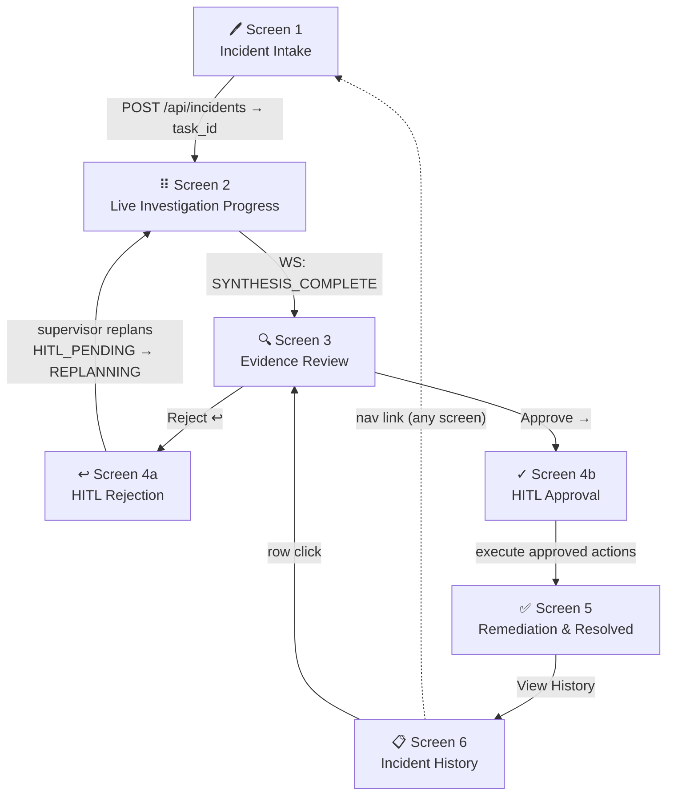

# AURA — Web UI Wireframes

Covers the six primary screens of the AURA Web UI plus component overlays.
Primary reference: `ARCHITECTURE.md` § Web UI container and `PRODUCTION_SPECIFICATIONS.md` § 3.

---

## Visual Key

| Symbol | Meaning |
|--------|---------|
| `╔═╗ ║` | Browser chrome / page container (outer frame) |
| `┌─┐ │` | Panel, card, or nested section |
| `●` | Live / WebSocket-connected indicator |
| `⠿` | Spinner — step in progress |
| `✅` | Step completed successfully |
| `⬜` | Step not yet started |
| `☑` / `☐` | Checkbox: selected / unselected |
| `▾` | Dropdown open | `▸` Collapsed section |
| `⚠` | Warning requiring attention |
| `🔴 🟡 🟢` | Severity / risk: P1-Critical / P2-P3 / P4-Low |
| `▐` | Confidence bar fill unit |

---

## Screen 1 — Incident Intake

```
╔═════════════════════════════════════════════════════════════════════════════╗
║  AURA                                  [Incident History]  [● dsushanth ▾] ║
╠═════════════════════════════════════════════════════════════════════════════╣
║                                                                             ║
║   New Investigation                                                         ║
║   ─────────────────────────────────────────────────────────────────────   ║
║                                                                             ║
║   Title *                                                                   ║
║   ┌─────────────────────────────────────────────────────────────────────┐  ║
║   │  e.g. "API gateway 5xx spike — us-east-1"                           │  ║
║   └─────────────────────────────────────────────────────────────────────┘  ║
║                                                                             ║
║   Severity *                    Scope (service / cluster / region) *       ║
║   ┌──────────────────────────┐  ┌───────────────────────────────────────┐  ║
║   │  🔴 P1 — Critical     ▾  │  │  payments-api / prod-us-east-1        │  ║
║   │  ──────────────────────  │  └───────────────────────────────────────┘  ║
║   │  🔴 P1 — Critical        │                                             ║
║   │  🟡 P2 — Major       ✓   │  Time Window                               ║
║   │  🟡 P3 — Minor           │  ┌──────────────────────┐  to              ║
║   │  🟢 P4 — Informational   │  │  2026-05-03  14:30   │                  ║
║   └──────────────────────────┘  └──────────────────────┘                  ║
║                                 ┌──────────────────────────────────────┐   ║
║                                 │  end (leave blank if ongoing)        │   ║
║                                 └──────────────────────────────────────┘   ║
║                                                                             ║
║   Symptoms *                                                   0 / 2000    ║
║   ┌─────────────────────────────────────────────────────────────────────┐  ║
║   │  Describe what you observed. Include error messages, affected       │  ║
║   │  user segments, and any recent changes you are aware of.            │  ║
║   │                                                                     │  ║
║   │                                                                     │  ║
║   └─────────────────────────────────────────────────────────────────────┘  ║
║                                                                             ║
║   Artifacts  (optional)                              [+ Attach artifact]   ║
║   ┌─────────────────────────────────────────────────────────────────────┐  ║
║   │  Type            Source                 Preview                     │  ║
║   │  ───────────────────────────────────────────────────────────────   │  ║
║   │  STACK_TRACE     Datadog alert          java.lang.NullPointer…  [✕] │  ║
║   │  ALERT_PAYLOAD   PagerDuty #P-9981      { "alertname": "5xx…" } [✕] │  ║
║   └─────────────────────────────────────────────────────────────────────┘  ║
║                                                                             ║
║   ─────────────────────────────────────────────────────────────────────   ║
║                                [Cancel]    [Start Investigation  →]        ║
║                                                                             ║
╚═════════════════════════════════════════════════════════════════════════════╝
```

**Notes**
- Severity dropdown shows all four levels inline; P1 jumps the supervisor task queue.
- Time window `end = null` signals "ongoing"; Supervisor uses a rolling 30-minute lookback.
- Artifact drawer expands on "[+ Attach artifact]" — see **Overlay A** below.
- Each artifact is capped at 10 KB; oversized files show an inline format error.
- "Start Investigation" POSTs to `/api/incidents` and navigates immediately to Screen 2 with the returned `task_id`.

---

## Screen 2 — Live Investigation Progress

```
╔═════════════════════════════════════════════════════════════════════════════╗
║  AURA                                  [Incident History]  [● dsushanth ▾] ║
╠═════════════════════════════════════════════════════════════════════════════╣
║                                                                             ║
║  ← Back   API gateway 5xx spike — us-east-1         🟡 P2 │ INVESTIGATING  ║
║           INC-2847  ·  Started 14:32  ·  us-east-1                         ║
║  ───────────────────────────────────────────────────────────────────────   ║
║                                                                             ║
║  ┌──── Investigation Graph ──────────────────────────────────────────────┐ ║
║  │                                                                         │ ║
║  │     ╔═════════╗     ╔══════╗    ┌─────────────┐                        │ ║
║  │     ║ INTAKE  ║────►║ PLAN ║───►│ 📡Telemetry │──┐                     │ ║
║  │     ║  ✅     ║     ║  ✅  ║    │    ⠿ 52%    │  │   ┌─────────────┐  │ ║
║  │     ╚═════════╝     ╚══════╝    └─────────────┘  ├──►│ SYNTHESIZE  │  │ ║
║  │                                 ┌─────────────┐  │   │   ⬜ waiting │  │ ║
║  │                            ├───►│  💻 Code    │──┤   └─────────────┘  │ ║
║  │                            │    │    ⠿ 21%    │  │                     │ ║
║  │                            │    └─────────────┘  │                     │ ║
║  │                            │    ┌─────────────┐  │                     │ ║
║  │                            └───►│  📄 Context │──┘                     │ ║
║  │                                 │    ⠿ 68%    │                        │ ║
║  │                                 └─────────────┘                        │ ║
║  └─────────────────────────────────────────────────────────────────────────┘ ║
║                                                                             ║
║  ┌──── Timeline  ● LIVE ─────────────────────┐  ┌──── Status ───────────┐ ║
║  │                                            │  │                        │ ║
║  │  ✅ 14:32:01  Task claimed by supervisor   │  │  Agents active         │ ║
║  │  ✅ 14:32:02  Graph planned  (3 agents)    │  │  ┌──────────────────┐  │ ║
║  │  ✅ 14:32:03  Security scan passed         │  │  │ 📡 Telemetry  ●  │  │ ║
║  │                                            │  │  │ 💻 Code       ●  │  │ ║
║  │  ⠿ 14:32:04  Telemetry  — querying…       │  │  │ 📄 Context    ●  │  │ ║
║  │  ⠿ 14:32:04  Code       — querying…       │  │  └──────────────────┘  │ ║
║  │  ⠿ 14:32:04  Context    — querying…       │  │                        │ ║
║  │                                            │  │  Elapsed   00:01:12    │ ║
║  │                           [Raw events ▸]   │  │  Remaining ~01:48      │ ║
║  └────────────────────────────────────────────┘  └────────────────────────┘ ║
║                                                                             ║
║  ┌──── Agent Activity ───────────────────────────────────────────────────┐ ║
║  │                                                                         │ ║
║  │  📡 Telemetry  ██████████▒▒▒▒▒▒▒▒▒▒  52%   Querying Prometheus…      │ ║
║  │  💻 Code       ████▒▒▒▒▒▒▒▒▒▒▒▒▒▒▒▒  21%   Fetching recent commits…  │ ║
║  │  📄 Context    ██████████████▒▒▒▒▒▒  68%   Searching Jira tickets…   │ ║
║  │                                                                         │ ║
║  └─────────────────────────────────────────────────────────────────────────┘ ║
║                                                                             ║
╚═════════════════════════════════════════════════════════════════════════════╝
```

**Notes**
- Page subscribes to `WS /ws/investigations/{task_id}` on load.
- Investigation Graph reflects live state; active nodes are highlighted and `⠿` becomes `✅` on `AGENT_COMPLETE`.
- Timeline items append on each `TaskProgressEvent`; "Raw events" expands to a JSON stream.
- Progress bars are derived from the elapsed/deadline ratio in `AgentTask.deadline`.
- On `SYNTHESIS_COMPLETE` event, page automatically transitions to Screen 3.

---

## Screen 3 — Evidence Review

```
╔═════════════════════════════════════════════════════════════════════════════╗
║  AURA                                  [Incident History]  [● dsushanth ▾] ║
╠═════════════════════════════════════════════════════════════════════════════╣
║                                                                             ║
║  ← Back   API gateway 5xx spike — us-east-1       🟡 P2 │ AWAITING REVIEW  ║
║           INC-2847  ·  Completed 14:34:51  ·  us-east-1                    ║
║  ───────────────────────────────────────────────────────────────────────   ║
║                                                                             ║
║  ┌──── Confidence ──────────────────────────────────────────────────────┐  ║
║  │                                                                        │  ║
║  │  Overall    ████████████████████▒▒▒▒  0.81 / 1.0   🟢 HIGH           │  ║
║  │                                                                        │  ║
║  │  Citation strength    0.85   ███████████████████▒▒                    │  ║
║  │  Agent agreement      0.90   ████████████████████▒                    │  ║
║  │  Memory match boost  +0.08   ████                                     │  ║
║  │  Rejection penalty    0.00   —                                         │  ║
║  └────────────────────────────────────────────────────────────────────────┘  ║
║                                                                             ║
║  ┌──── Diagnostic Narrative ────────────────────────────────────────────┐  ║
║  │                                                                        │  ║
║  │  A 4× increase in HTTP 5xx errors began at 14:31 UTC on the           │  ║
║  │  payments-api service in us-east-1. Telemetry confirms the onset      │  ║
║  │  correlates with deploy payments-api@v2.14.1 at 14:29 UTC [¹].       │  ║
║  │  Commit a3f9c2d introduced a nil-pointer dereference in the           │  ║
║  │  PaymentProcessor.charge() path [²]. A similar regression occurred   │  ║
║  │  in INC-2291 (2026-03-11) with an identical stack trace pattern [³].  │  ║
║  │                                                                        │  ║
║  │  [¹] Prometheus  [²] GitHub: a3f9c2d  [³] Prior incident INC-2291    │  ║
║  └────────────────────────────────────────────────────────────────────────┘  ║
║                                                                             ║
║  ┌──── Agent Evidence ──────────────────────────────────────────────────┐  ║
║  │  [ 📡 Telemetry ▸ ]  [ 💻 Code ]  [ 📄 Context ]                     │  ║
║  │  ──────────────────────────────────────────────────────────────────  │  ║
║  │                                                                        │  ║
║  │  METRIC_ANOMALY                                          conf: 0.92   │  ║
║  │  ┌──────────────────────────────────────────────────────────────┐    │  ║
║  │  │  p95 latency: 780ms → 4.2s  (onset 14:31:02 UTC)            │    │  ║
║  │  │  Error rate:  12/min → 442/min  · source: Prometheus         │    │  ║
║  │  └──────────────────────────────────────────────────────────────┘    │  ║
║  │                                                                        │  ║
║  │  ERROR_BURST                                             conf: 0.88   │  ║
║  │  ┌──────────────────────────────────────────────────────────────┐    │  ║
║  │  │  java.lang.NullPointerException in PaymentProcessor.charge() │    │  ║
║  │  │  442 occurrences/min  ·  0 occurrences before 14:31          │    │  ║
║  │  └──────────────────────────────────────────────────────────────┘    │  ║
║  └────────────────────────────────────────────────────────────────────────┘  ║
║                                                                             ║
║  ─────────────────────────────────────────────────────────────────────────  ║
║  Root Cause Candidates                                                      ║
║  ─────────────────────────────────────────────────────────────────────────  ║
║  1. ●  Nil-pointer in PaymentProcessor.charge() — commit a3f9c2d          ║
║        ▐▐▐▐▐▐▐▐▐▐▐▐▐▐▐▐▐▐▐▐▐▐  0.88                                      ║
║  2. ○  Connection pool exhaustion under increased load                     ║
║        ▐▐▐▐▐▐▐▐                  0.32  ▸ (expand)                         ║
║                                                                             ║
║  Recommended Actions                                                        ║
║  ─────────────────────────────────────────────────────────────────────────  ║
║  •  Rollback payments-api to v2.13.9                                       ║
║  •  Apply hotfix per runbook PAY-5xx §3.2                                  ║
║  •  Open regression ticket against commit a3f9c2d                          ║
║                                                                             ║
║  Prior Incident Match   INC-2291 (2026-03-11)  similarity 0.91  [View →]  ║
║                                                                             ║
║                                      [Reject ↩]   [Approve & Remediate →] ║
║                                                                             ║
╚═════════════════════════════════════════════════════════════════════════════╝
```

**Notes**
- Confidence bar color-coded: 🟢 ≥ 0.75, 🟡 0.50–0.74, 🔴 < 0.50.
- Footnotes `[¹]` `[²]` `[³]` in the narrative are clickable; each opens **Overlay B** (evidence deep-link drawer).
- Agent evidence tabs are independently selectable; default shows the highest-confidence agent.
- Non-primary root cause candidates are collapsed; `▸` expands supporting evidence.
- "Reject ↩" → Screen 4a; "Approve & Remediate →" → Screen 4b.

---

## Screen 4a — HITL Rejection

```
╔═════════════════════════════════════════════════════════════════════════════╗
║  AURA                                  [Incident History]  [● dsushanth ▾] ║
╠═════════════════════════════════════════════════════════════════════════════╣
║                                                                             ║
║  ← Back to Evidence                                                         ║
║                                                                             ║
║  ╔════════════════════════════════════════════════════════════════════╗     ║
║  ║                                                                     ║     ║
║  ║   ↩  Reject Investigation                                           ║     ║
║  ║   ────────────────────────────────────────────────────────────    ║     ║
║  ║                                                                     ║     ║
║  ║   INC-2847  ·  API gateway 5xx spike — us-east-1                   ║     ║
║  ║   Current confidence: 0.81  ·  Iteration 1 of 3                    ║     ║
║  ║                                                                     ║     ║
║  ║   What is wrong with this diagnosis?                                ║     ║
║  ║   ┌─────────────────────────────────────────────────────────────┐  ║     ║
║  ║   │  ☑  Wrong service identified                                 │  ║     ║
║  ║   │  ☐  Incorrect time window                                    │  ║     ║
║  ║   │  ☐  Missing data source  ──► Specify: [                  ]  │  ║     ║
║  ║   │  ☐  Root cause already known                                 │  ║     ║
║  ║   │  ☐  Other                                                    │  ║     ║
║  ║   └─────────────────────────────────────────────────────────────┘  ║     ║
║  ║                                                                     ║     ║
║  ║   Additional context for the supervisor              0 / 500        ║     ║
║  ║   ┌─────────────────────────────────────────────────────────────┐  ║     ║
║  ║   │  Describe why the diagnosis is incorrect or incomplete.     │  ║     ║
║  ║   │  The supervisor will use this to replan the investigation.  │  ║     ║
║  ║   │                                                              │  ║     ║
║  ║   └─────────────────────────────────────────────────────────────┘  ║     ║
║  ║                                                                     ║     ║
║  ║   ⚠  Rejection sends the investigation back to planning.           ║     ║
║  ║      At iteration 3, the button becomes "Escalate manually".        ║     ║
║  ║                                                                     ║     ║
║  ║              [Cancel]        [Send back for replanning  ↩]         ║     ║
║  ║                                                                     ║     ║
║  ╚═════════════════════════════════════════════════════════════════════╝     ║
║                                                                             ║
╚═════════════════════════════════════════════════════════════════════════════╝
```

**Notes**
- POSTs `{ decision: "REJECTED", reason: "...", categories: [...] }` to `/api/investigations/{task_id}/hitl`.
- Supervisor transitions `HITL_PENDING → REPLANNING`; page navigates back to Screen 2.
- At iteration 3, "Send back for replanning" is replaced by "Escalate manually" which opens a PagerDuty bridge.

---

## Screen 4b — HITL Approval & Remediation Trigger

```
╔═════════════════════════════════════════════════════════════════════════════╗
║  AURA                                  [Incident History]  [● dsushanth ▾] ║
╠═════════════════════════════════════════════════════════════════════════════╣
║                                                                             ║
║  ← Back to Evidence                                                         ║
║                                                                             ║
║  ╔════════════════════════════════════════════════════════════════════╗     ║
║  ║                                                                     ║     ║
║  ║   ✓  Approve & Remediate                                            ║     ║
║  ║   ────────────────────────────────────────────────────────────    ║     ║
║  ║                                                                     ║     ║
║  ║   INC-2847  ·  API gateway 5xx spike  ·  Confidence 0.81  🟢 HIGH ║     ║
║  ║                                                                     ║     ║
║  ║   Select actions to execute *                                       ║     ║
║  ║   ┌─────────────────────────────────────────────────────────────┐  ║     ║
║  ║   │                                           Est.    Risk       │  ║     ║
║  ║   │  ☑  Rollback payments-api → v2.13.9      3 min   🟢 Low    │  ║     ║
║  ║   │     Automated  ·  Reversible                                 │  ║     ║
║  ║   │  ───────────────────────────────────────────────────────    │  ║     ║
║  ║   │  ☑  Open regression ticket for a3f9c2d    —      🟢 Low    │  ║     ║
║  ║   │     Automated  ·  Creates Jira ticket  ·  Irreversible       │  ║     ║
║  ║   │  ───────────────────────────────────────────────────────    │  ║     ║
║  ║   │  ☐  Apply hotfix per runbook PAY-5xx §3.2  15 min 🟡 Med   │  ║     ║
║  ║   │     Manual  ·  Requires on-call confirmation                 │  ║     ║
║  ║   └─────────────────────────────────────────────────────────────┘  ║     ║
║  ║                                                                     ║     ║
║  ║   ⚠  You are about to execute automated changes in production.     ║     ║
║  ║      Action is logged and attributed to: dsushanth@…               ║     ║
║  ║                                                                     ║     ║
║  ║   Confirm identity to proceed                                       ║     ║
║  ║   ┌───────────────────────────────────────────────┐                ║     ║
║  ║   │  Password or SSO token                    🔑  │                ║     ║
║  ║   └───────────────────────────────────────────────┘                ║     ║
║  ║                                                                     ║     ║
║  ║   [Cancel]                 [Execute 2 selected actions  ✓]         ║     ║
║  ║                                                                     ║     ║
║  ╚═════════════════════════════════════════════════════════════════════╝     ║
║                                                                             ║
╚═════════════════════════════════════════════════════════════════════════════╝
```

**Notes**
- Re-authentication satisfies the §3.5 HITL elevated-scope requirement.
- Button label updates dynamically to reflect the number of checked actions.
- Each action shows estimated time, reversibility, and risk level so operators can make informed selections.
- POSTs `{ decision: "APPROVED", approved_action_ids: [...] }` to the remediation endpoint; navigates to Screen 5.

---

## Screen 5 — Remediation in Progress & Completion

```
╔═════════════════════════════════════════════════════════════════════════════╗
║  AURA                                  [Incident History]  [● dsushanth ▾] ║
╠═════════════════════════════════════════════════════════════════════════════╣
║                                                                             ║
║  API gateway 5xx spike — us-east-1              🟡 P2  │  ✅ RESOLVED      ║
║  INC-2847  ·  Resolved 14:41:03 UTC  ·  us-east-1                          ║
║  ───────────────────────────────────────────────────────────────────────   ║
║                                                                             ║
║  ┌──── Error Rate Recovery ──────────────────────────────────────────────┐ ║
║  │                                                                         │ ║
║  │  errors/min                                                             │ ║
║  │  500 ┤                                                                  │ ║
║  │  400 ┤              ╭────────╮                                          │ ║
║  │  300 ┤              │        │                                          │ ║
║  │  200 ┤   ───────────╯        ╰──────────╮                              │ ║
║  │  100 ┤                                  ╰─────────────────             │ ║
║  │    0 ┼──────────────────────────────────────────────────              │ ║
║  │      14:28   14:31   14:34   14:37   14:40   14:43                    │ ║
║  │              ↑ deploy v2.14.1              ↑ rollback v2.13.9          │ ║
║  └─────────────────────────────────────────────────────────────────────────┘ ║
║                                                                             ║
║  ┌──── Remediation Log ──────────────────────────────────────────────────┐ ║
║  │                                                                         │ ║
║  │  ✅ 14:39:11  Rollback initiated — payments-api → v2.13.9              │ ║
║  │  ✅ 14:40:44  Rollback complete  — all pods healthy (3/3)              │ ║
║  │  ✅ 14:41:01  Jira ticket created — PAY-4824 (a3f9c2d regression)      │ ║
║  │  ✅ 14:41:03  Incident memory written to Vector DB                     │ ║
║  │                                                                         │ ║
║  └─────────────────────────────────────────────────────────────────────────┘ ║
║                                                                             ║
║  ┌──── Investigation Summary ────────────────────────────────────────────┐ ║
║  │                                                                         │ ║
║  │  Root cause      Nil-pointer in PaymentProcessor.charge() (a3f9c2d)   │ ║
║  │  Confidence      0.81  🟢                                               │ ║
║  │  Time to HITL    2m 51s                                                 │ ║
║  │  Time to resolve 8m 52s                                                 │ ║
║  │  Reviewer        dsushanth                                              │ ║
║  │  Decision        APPROVED  (2 of 3 actions executed)                   │ ║
║  │  Resolved at     14:41:03 UTC                                           │ ║
║  │                                                                         │ ║
║  └─────────────────────────────────────────────────────────────────────────┘ ║
║                                                                             ║
║  ───────────────────────────────────────────────────────────────────────   ║
║                             [View full evidence]   [New investigation  +]  ║
║                                                                             ║
╚═════════════════════════════════════════════════════════════════════════════╝
```

**Notes**
- Error Rate Recovery chart is rendered from post-incident telemetry; hidden if data source is unavailable.
- "Time to resolve" = HITL approval timestamp − intake timestamp.
- Summary block is also emitted as the incident close event to ITSM connectors (Jira / ServiceNow).

---

## Screen 6 — Incident History

```
╔═════════════════════════════════════════════════════════════════════════════╗
║  AURA                              [+ New Investigation]  [● dsushanth ▾]  ║
╠═════════════════════════════════════════════════════════════════════════════╣
║                                                                             ║
║  Incident History                                                           ║
║  ───────────────────────────────────────────────────────────────────────   ║
║                                                                             ║
║  ┌──────────────────┐  ┌──────────────────┐  ┌───────────────┐  ┌───────┐ ║
║  │  247             │  │  3m 12s          │  │  0.79         │  │  94%  │ ║
║  │  Total (30d)     │  │  Avg time-to-    │  │  Avg          │  │  Re-  │ ║
║  │                  │  │  diagnose        │  │  confidence   │  │ solved│ ║
║  └──────────────────┘  └──────────────────┘  └───────────────┘  └───────┘ ║
║                                                                             ║
║  Search ┌──────────────────────────────────┐  Severity [All ▾]             ║
║         │  🔍  Filter by title or service…  │  Status   [All ▾]             ║
║         └──────────────────────────────────┘  Date     [Last 30d ▾]        ║
║                                                                             ║
║  ┌──────────────────────────────────────────────────────────────────────┐  ║
║  │  ID        Title                            Sev   Status      Conf Age│  ║
║  │  ──────────────────────────────────────────────────────────────────  │  ║
║  │  INC-2847  API gateway 5xx — us-east-1      🟡P2  ✅ Resolved  0.81 2h│  ║
║  │  INC-2831  Auth service latency spike        🟡P2  ✅ Resolved  0.74 1d│  ║
║  │  INC-2819  Checkout timeout — EU region      🔴P1  ✅ Resolved  0.93 3d│  ║
║  │  INC-2801  Worker pool queue depth alert     🟢P3  ✅ Resolved  0.68 5d│  ║
║  │  INC-2790  DB connection pool exhaustion     🔴P1  ✅ Resolved  0.89 7d│  ║
║  │  INC-2776  Cache invalidation storm          🟡P2  ↩ Rejected  0.41 9d│  ║
║  │  INC-2762  Memory leak — recommendation-svc  🟢P3  ✅ Resolved  0.72 12d│  ║
║  │  ...                                                                  │  ║
║  │                                                                       │  ║
║  │  ← Previous   Page 1 of 8   Next →                                   │  ║
║  └──────────────────────────────────────────────────────────────────────┘  ║
║                                                                             ║
╚═════════════════════════════════════════════════════════════════════════════╝
```

**Notes**
- Stats bar aggregates the last 30 days, matching the default date filter.
- Rows are clickable and navigate to Screen 3 (Evidence Review) for that incident.
- "Rejected" rows are shown with amber styling; they can be re-opened via the row action menu `[…]`.
- Confidence column is absent for in-progress investigations.
- Column headers are sortable; default sort is ID descending.

---

## Navigation Flow



---

## Overlay A — Attach Artifact Drawer

Triggered from the "[+ Attach artifact]" button on Screen 1.

```
╔════ Attach Artifact ════════════════════════════════════════════════════╗
║                                                                          ║
║  Type *                                                                  ║
║  ┌──────────────────────────────────────────────────────────────────┐   ║
║  │  STACK_TRACE      Formatted exception with stack frames       ▾  │   ║
║  │  ────────────────────────────────────────────────────────────    │   ║
║  │  STACK_TRACE      Formatted exception with stack frames          │   ║
║  │  ALERT_PAYLOAD    Raw JSON from PagerDuty / Opsgenie             │   ║
║  │  LOG_EXCERPT      Structured or raw log lines                    │   ║
║  │  METRIC_SNAPSHOT  CSV or JSON time-series data                   │   ║
║  │  OTHER            Free-form text                                  │   ║
║  └──────────────────────────────────────────────────────────────────┘   ║
║                                                                          ║
║  Source label  (optional)                                                ║
║  ┌──────────────────────────────────────────────────────────────────┐   ║
║  │  e.g. "Datadog alert #ABC123"                                    │   ║
║  └──────────────────────────────────────────────────────────────────┘   ║
║                                                                          ║
║  Content *                                         0 / 10 240 bytes     ║
║  ┌──────────────────────────────────────────────────────────────────┐   ║
║  │  Paste here or drag-and-drop a file…                             │   ║
║  │                                                                  │   ║
║  │                                                                  │   ║
║  └──────────────────────────────────────────────────────────────────┘   ║
║                                                                          ║
║                           [Cancel]   [Add Artifact  +]                  ║
║                                                                          ║
╚══════════════════════════════════════════════════════════════════════════╝
```

---

## Overlay B — Evidence Deep-Link Drawer

Triggered when a footnote reference `[¹]` `[²]` `[³]` is clicked in the Screen 3 narrative.

```
╔════ Evidence Source ══════════════════════════════╗
║                                                    ║
║  [²]  GitHub commit                                ║
║  ──────────────────────────────────────────────   ║
║                                                    ║
║  Repo     payments-api                             ║
║  Commit   a3f9c2d                                  ║
║  Author   k.lee                                    ║
║  Date     2026-05-03  14:29 UTC                    ║
║  Message  "Add retry logic to charge() path"       ║
║                                                    ║
║  Diff excerpt                                      ║
║  ┌──────────────────────────────────────────────┐  ║
║  │  - if (resp != null) {                       │  ║
║  │  + if (resp.data != null) {  // bug          │  ║
║  └──────────────────────────────────────────────┘  ║
║                                                    ║
║  Confidence contribution:  0.88                    ║
║  Cited in root cause #1                            ║
║                                                    ║
║                        [Open in GitHub →]          ║
║                                                    ║
╚════════════════════════════════════════════════════╝
```
